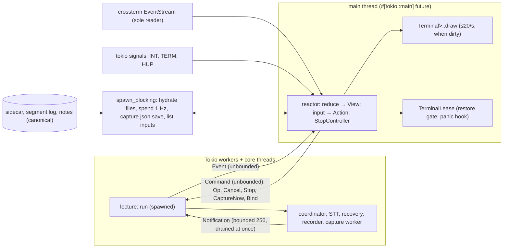

# M7 — Ratatui CLI: planning result

**Context.** LectureLive's core (M0–M6) is mature; its CLI is still one 810-line `main.rs` that prints lines. M7 makes Ratatui the CLI's first-class interactive frontend for the live `lecture` command, beside the unchanged desktop app, with `lecturelive-core` remaining the only authority for recording, transcription, recovery, snapshots, notes, slides and durability. Design input: the GPT-6 Pro report "LectureLive Ratatui Integration Design" (written against `394bd13`, M5 close-out), reconciled here against HEAD. This file is the planning result; on approval it becomes `docs/superpowers/plans/2026-09-26-m7-ratatui-cli.md` (Task 0).

Decisions taken during planning (asked, answered):
- **Capture in the CLI:** on by default in the live `lecture` command (no flag), using M5's engine and the course's saved selection. It follows Zoom by window id, so Zoom never has to be in front, and it re-finds the slide across full screen and resizes.
- **First-time automatic Zoom window and region detection:** its own milestone after M7 (M8, "Automatic Zoom capture"), not M7.

---

## A. Baseline

| Item | Finding (inspected 2026-09-26) |
|---|---|
| Branch | `main` |
| HEAD | `fcf1d4ede1fd719d51edc2f0d8a37375b9f69dfa`, "Record the sitting: Polish after a lecture built, and the built app's security policy checked" |
| Working tree | clean; `main` level with `origin/main`; one worktree; no other branches |
| Ratatui / Crossterm locally | **absent** from `crates/cli/Cargo.toml` and `Cargo.lock`, and there are no uncommitted edits. Every M7 dependency is a fresh addition. |
| M6 merged | yes: M6 and its findings (`92cfd32`), then D1 (`39def51`, `Lecture::polish_after`, desktop only) and `fcf1d4e`, all pushed |
| Post-M6 commits | `39def51` and `fcf1d4e`. Findings: "The CLI still polishes only inside a lecture." |
| `live_notes.py` / `pyproject.toml` | Still tracked, on purpose. M6 Task 17 removes them only after the real lecture's gate lines hold. |
| M6 status row | "in progress: the two-hour lecture waits for a real class". Gate lines 1–2 are unticked (not run); line 3 (mixed mode) is ticked. |
| CLI tests | `cargo test -p lecturelive-cli`: 1 test (`a_relative_folder_is_made_absolute_before_the_course_is_read`) |
| Core's print sites | None on the live path. `println!`/`eprintln!` appear only in tests, the canary's `input::record_for` and `tone::play_tone`. Nothing in core can write into a fullscreen surface. |
| Deferred verification | `docs/VERIFICATION.html` "Your two-hour lecture with LectureLive" runs the **desktop app**. Its only CLI call is `./target/debug/lecturelive lecture audit --dir …`, which M7 keeps byte-identical in output and exit codes. |

**Deferred-verification ruling, as the docs will state it (Task 0):**

> M6 implementation is accepted as the development baseline for M7. Remaining real-class verification is deferred and does not block M7 development.

Smallest truthful change to `docs/milestones.md`:
- **M6 Status cell** becomes "implementation accepted as M7's baseline; the two-hour real lecture (gate lines 1–2) is deferred to a class".
- **M6 section:** a paragraph *Baseline for M7* is added after *Next:*. It carries the ruling above, says gate lines 1–2 stay unticked until the run sheet is run (now against the newer build), and says Task 17 still waits for them.
- **Unchanged:** the line "The Python CLI (`live_notes.py`) stays the in-class tool until M6 passes", the run sheet, and the gate checkboxes.
- **New Status rows:**
  - `M7 | Ratatui CLI | planned | M6 (implementation baseline) | No | m7-ratatui-cli`
  - `M8 | Automatic Zoom capture | not yet planned | M7 | No | —` (M5's engine stays its foundation; M8 builds on M7's CLI capture behaviour, TUI capture state and frontend architecture)
- **New section:** an M7 section with tasks and an unticked gate.

---

## B. GPT-6 Pro reconciliation

Dispositions: STILL REQUIRED · PARTIALLY RESOLVED BY M6 · RESOLVED BY M6 · SUPERSEDED · REQUIRES MEASUREMENT · DEFER.

| # | Report recommendation | Current code | Current behaviour | Disposition | What M7 does |
|---|---|---|---|---|---|
| 1 | Extract a shared session driver from `main.rs`; plain + TUI adapters | `crates/cli/src/main.rs` (810 lines) | args, utilities, preflight, prepare lines, stdin grammar, Ctrl-C, `show`, end summary all in one file | STILL REQUIRED | Task 1: behaviour-preserving split with goldens first (§E) |
| 2 | Coordinator notifications: unbounded channel so nothing is lost | `coordinator.rs:197` `channel(256)`; `:283-285` `notify` uses `try_send`, "none is durable"; `:681` `SourceEnded` via `send_timeout(1 s)` | `SourceEnded` hardened in M6. Other notifications can drop only if `lecture::run`'s loop (`lecture.rs:448-499`) stops draining. That loop forwards each notification at once into an **unbounded** `Event` channel (`main.rs:651`) and never awaits a frontend. Spec §3.6 already makes a hole in segment ids trigger a re-read. | PARTIALLY RESOLVED BY M6 (`SourceEnded`); the rest SUPERSEDED by spec §3.6's reconcile rule | No core change. The contract is §C invariant 6.<br>• The TUI reads only the `Event` channel.<br>• Durable state (segments, notes, slides) reconciles by segment id, notes revision and hydration from files. A dropped `Segment` is always in the log, because the coordinator appends before it notifies (`coordinator.rs:459-466`).<br>• Latest-value telemetry (`Level`, `Open`, STT status) may be coalesced or lost without affecting correctness; M7 does not make it lossless.<br>Task 3 pins what matters: an unread frontend holds up neither `lecture::run` nor core, and control (`Stop`, `SourceEnded`, completion) stays correct. Only if a required non-reconstructible or control guarantee fails does the report's unbounded channel become a justified core change (Ruling). |
| 3 | Reliable stop: monotonic watch, never behind ordinary commands | `lecture.rs:458-475` reads `Command::Stop` from the **unbounded** command channel (`main.rs:730`); `coordinator.rs:106-108` `request_stop` `try_send` on `channel(8)` (`:195`) | That channel carries only `Stop` and `Cutoff`. Cutoffs come one at a time from the notes worker, so the first two stops cannot meet a full channel. | RESOLVED (by M3/M4 design; no M6 change needed) | No core change. Task 2: one `StopController` shared by both adapters, sending at most two `Stop`s |
| 4 | Typed work lifecycle: ids, kind, parent, origin, accepted/started/finished | `Busy(String)` at `lecture.rs:214` ("snapshot, …"), `:264` ("polishing …"), `:321` + `page.rs:307,311` (page progress). Ops carry no id. Queued ops dropped by Cancel or a second stop emit nothing (`lecture.rs:339-344`). | The desktop tells snapshot from page only by `startsWith` on the busy text (`session.svelte.ts:104-108`), and invents op ids in its adapter (`adapter.rs:57-60`) | SUPERSEDED for the TUI | No core change. The TUI is the only submitter in its session, so it keeps a FIFO of its own ops and closes each on its typed terminal event. Busy text is shown verbatim and never parsed (§F "Work lanes"). The desktop's prefix parsing stays the desktop's (M4 minor M3, "left for good" in M6). |
| 5 | Startup progress events and safe cancellation through `start::prepare` | `start.rs:25` `prepare(…, on_other_day)`. No cancel. Other-day recovery runs a whole coordinator session and "can take minutes". | CLI prints plain lines during prepare. Ctrl-C there is the default SIGINT (the tokio handler is installed after prepare, `main.rs:742`): the process dies, and core is crash-safe by design. | SUPERSEDED (TUI part); cancellable prepare DEFERRED | The TUI takes the terminal **after** prepare. Startup stays the plain lines, with today's Ctrl-C meaning, and the same lines seed the TUI's activity list. No core change. |
| 6 | State reads are not free; never per frame | `Command::State` → `Store::read` = `update(clone)` (`coordinator.rs:174-176`). `run_job` **always saves**: clone, JSON, fsync, rename (`:550-569`). | Every state read writes the sidecar to disk | STILL REQUIRED, stronger than the report | The TUI **never** sends `Command::State`. It hydrates from files: the sidecar (saved atomically before every store reply), the segment log, and the notes checked against the sidecar's len/SHA-256, as the desktop's `read_document` does. |
| 7 | Spend: sample off the render path; qualify the label | `spend.rs:120-126` `add_at` bumps totals, then appends while holding a std `Mutex` across read, write and `sync_data`. `lecture_total()` can block. | Desktop calls `lecture_total()` on every status flush (about 1 Hz) on a runtime task | STILL REQUIRED | Sample `lecture_total()` on `spawn_blocking` at most once a second, one call in flight. Label is the desktop's "$0.18 today"; help explains that speech-to-text is added when a recording closes. |
| 8 | CLI does not start native capture; add `--capture saved`, a numeric region picker | `main.rs:776` passes `capture: None`; `worker.rs:54-63` `words()` copy says "slides strip" | The CLI only imports screenshots (`SlideWatch`) | PARTIALLY (the fact still holds); flag and picker SUPERSEDED by the planning decision | Task 11: capture **on by default** in the live command (plain and TUI). `CaptureSetup { SystemWindows, capture.json[course], 1 s, Thresholds::default(), LECTURELIVE_RECORD }` as `app.rs:390-393` builds it. `CaptureMoved` is saved to `capture.json`. The CLI gets its own terminal wording. First-time automatic detection is M8. |
| 9 | Ratatui 0.30.2 + Crossterm 0.29.0; direct crossterm with `event-stream` + `bracketed-paste` | — | — | STILL REQUIRED (versions confirmed current) | `bracketed-paste` is already a crossterm default. Add `event-stream`. Import through `ratatui::crossterm`. Dependency gate (§I):<br>• exactly one crossterm 0.29.x;<br>• one ratatui;<br>• no Termion, Termwiz or Termina backend;<br>• new duplicates from `cargo tree -d` are reviewed and classified, not forbidden. |
| 10 | Own terminal lifecycle instead of `ratatui::init/run`; exactly-once restoration; panic hook for `panic = "abort"` | Root `Cargo.toml` `[profile.release] panic = "abort"` | Every `ratatui::init*` installs its own hook. `restore()` does not show the cursor, and `Terminal`'s `Drop` (which does) never runs under abort. | STILL REQUIRED | Task 5 `TerminalLease`: one restoration gate for normal, error, emergency and panic. Every step is attempted independently: paste off, leave alternate screen, cursor shown, raw mode off. |
| 11 | Third Ctrl-C `process::exit(130)` unsafe in TUI mode | `main.rs:749-754` | Exits without restoring anything | STILL REQUIRED | Stage 3 restores first, then exits 130 |
| 12 | Held key must not escalate: 300 ms quiet interval | — | macOS terminals report every repeat as `Press` (Terminal.app has no kitty protocol). The first repeat comes after the "Delay until repeat" setting, up to 1.8 s. | STILL REQUIRED, revised | Quiet interval alone would let the first repeat pass. Stages 2 and 3 need ≥300 ms quiet since the last Ctrl-C byte **and** ≥2 s since the stage before (§G). |
| 13 | SIGTERM graceful with 20 s/30 s headless deadlines; SIGHUP headless stop | Plain CLI: SIGTERM and SIGHUP are default, so the process dies | — | SUPERSEDED (new policy not justified); headless policy DEFERRED | TUI mode: SIGTERM and SIGHUP restore the terminal, then exit 143/129, which is today's outcome plus a working terminal |
| 14 | Intercept Ctrl-Z / SIGTSTP | tokio: registering SIGTSTP replaces the default "for the entire process" | In raw mode Ctrl-Z is a key, not a signal | PARTIALLY | Ctrl-Z key: a notice that suspending would stop capture. **Do not** register SIGTSTP. |
| 15 | F-key map (F1–F10), Ctrl-Q confirm, pane letters `b`/`o` | — | On a MacBook the F-row is media keys unless Fn is held, so F1 dims the screen | SUPERSEDED | Ctrl chords with the hint field always live; no single-letter commands; no Ctrl-Q (stage 3 is the emergency exit) (§H) |
| 16 | Admission: one active + one queued; RequestId | Plain and desktop queue without limit | — | SUPERSEDED (would be new policy) | Parity: no limit. One accepted key press sends exactly one `Command`; never retried. Queue depth is shown. |
| 17 | Hint ≤ 8 KiB; paste turns newlines into spaces and never submits | Plain has no cap | — | STILL REQUIRED | Over-cap paste is refused with a notice; never silently truncated |
| 18 | Mode rules: `--plain`/`--no-tui`, `--tui`, auto when stdin/stdout/stderr are TTYs and `TERM≠dumb` | — | crossterm reads `/dev/tty` when stdin is piped, and mio/kqueue then fails on macOS (EINVAL) | STILL REQUIRED | Auto also needs stdin to be a TTY: scripted stdin grammar and the macOS `/dev/tty` limitation. `--tui` with piped stdin is an error. |
| 19 | `--theme`, 256/16-colour ladder | `main.rs:441-444` `paint()`: colour when stdout is a TTY and `NO_COLOR` unset; truecolor from `COLORTERM`; `spend.rs:202-218` teal (93,184,192) / red (242,118,107) else ANSI | — | SUPERSEDED | Reuse the CLI's own detection and accents, on terminal default fg/bg. No theme flag. |
| 20 | `--ascii` flag + locale | — | — | PARTIALLY | Automatic by locale (`LC_ALL`/`LC_CTYPE`/`LANG` lacking UTF-8); flag DEFERRED |
| 21 | Neutralise control sequences in displayed text | Plain prints STT, model and file text raw | — | STILL REQUIRED | One `clean()` at the projection boundary (Task 6), also applied by plain on a TTY (Task 12) |
| 22 | `pulldown-cmark` for notes | Notes: `##`/`###`, nested bullets, bold, ``, `<!-- HH:MM:SS -->`, TeX `\(…\)`; tables possible after polish | — | STILL REQUIRED | `default-features = false`, tables on, math off (TeX stays literal, as in the desktop) |
| 23 | `tui-input` | 0.15.4 manifest: `default = ["ratatui-crossterm"]` = `ratatui/crossterm`, where `ratatui` is declared **without** `default-features = false`; optional direct `crossterm = "0.29.0"` | The default would switch Ratatui's default features back on (`all-widgets`, …) through feature unification, undoing §I's minimal set | STILL REQUIRED, with features corrected | `tui-input = { version = "0.15.4", default-features = false, features = ["crossterm"] }`. LectureLive renders the prompt itself from `value()`, `visual_cursor()` and `visual_scroll(width)`, so tui-input's Ratatui integration is not needed. Its crossterm map (Ctrl-A/B/E/F/H/K/U/W/Y, Meta word keys) does not overlap M7's chords. Lands in Task 10. |
| 24 | `tracing` + subscriber + appender file logs | Core has no `tracing` and never prints on the live path | — | SUPERSEDED | Rejected. There is nothing to log: notices live in the activity list, and fatal text goes to stderr after restoration. Under abort the appender's queue is lost anyway. |
| 25 | `insta`, `portable-pty` (nix 0.28, serial2), `vt100` | `rustix 1.1.5` and `tempfile 3.27.0` already in `Cargo.lock` | — | SUPERSEDED | Plain golden files; a ~100-line rustix PTY harness; byte and termios assertions (§I) |
| 26 | Activity: 500 records; notices expire after 4 s/6 s | Desktop: latest notice stays until replaced; 50 kept | — | PARTIALLY | 500-record ring with an explicit "older notices are not kept" line. The notice line follows the desktop's priority rule, with no expiry timers. |
| 27 | Performance targets (20 fps cap, 10 Hz preview, p95 frame ≤ 8/16.7 ms, CPU, memory) | Desktop precedent: p95 < 16.7 ms on the 500-delta/s burst and the two-hour fixture | — | REQUIRES MEASUREMENT | Task 13, as acceptance targets |
| 28 | Layout sizes 140×40, 110×32, 80×24, 60×16, below minimum | Display is 1168 pt wide, so a half-screen terminal beside Zoom is about 72–87 columns | — | STILL REQUIRED, extended | Add a stacked variant for tall, narrow windows (≥36 rows, <100 columns), checked at 72×45 |
| 29 | Plain `lecture page`/`spend`/`audit` stay conventional; the TUI never runs `lecture page` against its own locked folder | — | — | STILL REQUIRED | These one-shots are untouched, and `audit` output and exit codes are pinned (Task 1) |
| 30 | Pending-material counters from cursors | Cursor known only after re-reading the sidecar per commit | Desktop does not show it | DEFER | The start-up "resumed with N lines and M slides" line goes into activity |
| 31 | Hydration: verify len/hash, retry, never roll back | Desktop: 2 retries, 50 ms apart, then the file as it is (`app.rs:190-195`) | — | STILL REQUIRED | Same rule; results carry the revision and last segment id they read (§F) |
| 32 | `ratatui-image` thumbnails later | 11.1.0; default `chafa-dyn` needs pkg-config and libchafa | — | DEFER | §M |
| 33 | Stop supervisor alive through the final snapshot | After the coordinator ends, `lecture::run` reads no commands, and the last snapshot uses `Cancel::never` (`lecture.rs:517`) | — | STILL REQUIRED (frontend) | The reactor keeps reading keys until `lecture::run` returns, so stage 3 always works. Copy never claims stage 2 aborts the last snapshot. |
| 34 | M6 audio-overflow blockers | capture-ring tail drop taken in M6 (50/50 under load) | — | RESOLVED BY M6 | None |
| 35 | Report: README still Python-era | still true | M6 Task 17 rewrites it after the lecture | — | M7 does not touch README |

**Found while reconciling, not in the report** (recorded, not fixed opportunistically):
- **(a) Plain CLI stop mislabel.** After `--secs` fires (core `stops = 1`), the first Ctrl-C prints the stage-1 text while core already hurries. Cause: the Ctrl-C counter at `main.rs:743` is separate from the timer. Task 2 fixes it, because the shared controller must count both.
- **(b) Core copy written for the desktop.** `CaptureState::words()` says "choose … in the slides strip". Task 11 gives the CLI its own wording.
- **(c) Possible `--rebuild` bug (unverified; agent reading).** `prepare` runs `launch::recover` before `folder::open`, and `recover_one` errors on a corrupt sidecar, so `--rebuild` may never be reached. Out of M7 scope (§M).
- **(d) Desktop quirks:**
  - a `SourceEnded` does not count as a stop, so the app's first "Stop waiting" is level 1;
  - a page's busy text can hide Cancel.

  Both are desktop-only and out of scope (§M).

---

## C. M7 architectural invariants

1. **One engine.** `lecture::run` (or `Lecture::page` for `lecture page`) is the only thing that records, transcribes, recovers, commits, registers slides or writes lecture files. CLI code never writes lecture files, with two exceptions: `capture.json`, through `Selections::save` exactly as the desktop does; and fixture folders created in tests.
2. **No core source changes in M7.** `crates/core/src` and the desktop (`apps/desktop/`) are untouched. Core gains **tests only** (Task 3). If a task finds it needs a core change, it stops and records a Ruling with evidence instead.
3. **The frontend never backpressures core.** The TUI consumes the unbounded `Event` channel and sends on the unbounded `Command` channel. No core task ever awaits the TUI. Terminal writes happen only on the main thread (the `#[tokio::main]` future). `lecture::run` is `tokio::spawn`ed onto worker threads.
4. **One owner of view state.** The reactor on the main thread owns the projection and the UI state. There is no `Arc<Mutex<…>>` view state and no second projection task. File reads, spend sampling and `capture.json` saves run on `spawn_blocking` and return through channels.
5. **Canonical beats provisional.** Preview text is never written, never promoted and never counted as committed. A `Committed`, `Polished` or hydrated revision replaces it in the same state update.
6. **Durable identifiers reconcile.**
   - Segment ids (log positions): duplicates are ignored, and a hole causes rehydration.
   - Notes revisions: a block is appended only at `held + 1`; `≤ held` still ends the preview; a jump or `Polished` causes rehydration.
   - Slide indices: duplicates are ignored.
   - A hydration result never rolls the view back.
   - **Latest-value telemetry** (`Level`, `Open`, STT status) is cosmetic between its canonical sources. A value may be coalesced or lost, and the next one replaces it. No correctness, count or durable display depends on receiving every one.
7. **No state polling of core.** Never `Command::State`, never `lecture_total()` on the reactor thread.
8. **Every accepted key press sends at most one `Command`,** never retried. The TUI refuses ops while stopping with the desktop's words and does not send them.
9. **Stop semantics are core's.** Stage 1 = one `Stop`. Stage 2 = `Stop`s until core has counted two. Stage 3 = restore the terminal, then exit 130. No stage claims to abort the in-flight request or the last snapshot.
10. **Terminal restored before any exit** the process controls: normal end, returned error, emergency stage, SIGTERM/SIGHUP, draw or input failure, panic (hook). One gate, claimed once.
11. **Plain mode survives unchanged,** except the two deliberate fixes named here: the stop mislabel (Task 2) and control characters cleaned on a TTY (Task 12). Plain and non-TTY output contain no terminal control sequences unless stdout is a TTY with colour allowed.
12. **Untrusted text is cleaned once** at the projection boundary (transcript, notes, previews, file names, error strings, window titles). Markdown links never become terminal hyperlinks.
13. **No Busy parsing.** Busy text is displayed verbatim; lane state comes from typed events and the TUI's own submissions.
14. **The TTY default switch is the last behaviour change** (Task 16), after `--tui` has passed PTY, performance and review gates.
15. **The fixture seam is debug/test only.**
    - `fixture.rs` and every branch that reaches it compile only under `#[cfg(debug_assertions)]`.
    - Why not `cfg(test)`: integration and PTY tests run the ordinary dev binary (`CARGO_BIN_EXE_lecturelive`), which is not compiled with `cfg(test)`.
    - A build without debug assertions has no fake engine. If `LECTURELIVE_CLI_FIXTURE` is set, its live command refuses to start, before any check is skipped or any file is touched.

---

## D. Necessary core-contract changes

**None.** Evidence per area:

| Area | Evidence at HEAD | Conclusion |
|---|---|---|
| Notification delivery | `lecture::run` drains the coordinator's 256 channel in a loop with no awaits on frontends (`lecture.rs:448-499`) into an unbounded `Event` channel. `SourceEnded` is waited for (`coordinator.rs:681`). Every `Segment` is in the log before its notification (`coordinator.rs:459-466`), and spec §3.6 reconciles a hole by re-reading. `Level`/`Open`/STT status are latest-value, so a lost one is replaced by the next. Lecture-level results (`Committed`, `Polished`, `Slide`, …) go straight onto the unbounded channel. | No change. Task 3 proves the requirements that matter: no backpressure from an unread frontend, correct control and completion, and durable state recoverable from files. It asserts nothing about how many `Level` samples arrive. Only a failure of a genuinely required control or non-reconstructible guarantee makes the report's unbounded channel a justified core change (Ruling, then the person decides). |
| Stop delivery | Unbounded lecture `Command`; the coordinator's `request_stop` channel holds at most one cutoff | No change |
| Busy / work identity | The TUI's FIFO + typed terminal events suffice (§F) | No change |
| Startup | The TUI enters after `prepare`; `announce` and the launch report are enough for plain lines and the activity seed | No change |
| Capture | `CaptureSetup`, `Selections`, `SystemWindows`, `Command::{CaptureNow, Bind}` exist and are used by the desktop | No change |
| Spend | Sampled off-thread | No change |
| After-class polish | Desktop only; the CLI's surface stays "polish inside a lecture" | No change (§M) |

---

## E. CLI extraction architecture

### Current `main.rs` responsibilities → owner

| Responsibility (lines) | New owner |
|---|---|
| clap types `Cli`, `Cmd`, `LectureArgs`, `Loopback`, `Canary` (28–185) | `args.rs` (moved verbatim; Task 4 adds `--tui`, `--plain`/`--no-tui`) |
| `data_dir` (187–191), `main` dispatch (193–212) | `main.rs` (~50 lines) |
| `loopback_cmd`, `record` + its notification printer, `canary`, `inputs`/`outputs` (196–424) | `utility.rs` (moved verbatim; `record` stays plain forever) |
| `REPO_ENV`, `CLI_LEDGER`, `env_value`, `resolve_input`, `resolve_mixed`, `source_for`, `lecture_dir` (+ its test), `audit_cmd` (426–530) | `lecture.rs` |
| `lecture_cmd`: spend/audit/page one-shots, key/course/input preflight, mic check, lock, route restore, `prepare` (616–716) | `lecture.rs` (preflight, `prepare`, one-shots, mode choice, spawning `lecture::run` or the fixture) |
| `paint`, `say`, `plural`, `sentence`, `secs`, `other_inputs`, `show` (436–614) | `plain.rs` (writer-based, Task 1) |
| startup report lines (683–727) | `plain.rs::print_prepared` |
| stdin grammar thread (730–740) | `plain.rs::read_commands` + `parse_line` (shared with the TUI) |
| Ctrl-C escalation task (741–760) and `--secs` timer (761–767) | Task 1: `plain.rs` verbatim. Task 2: `stop.rs::StopController`. |
| end summary (777–790) | `plain.rs::print_end` (the TUI prints it too, after restoring) |

**Dependency direction:**
- `main` → {`args`, `utility`, `lecture`}
- `utility` → `plain`, `lecture` (resolution helpers)
- `lecture` → {`plain`, `stop`, `capture`, `tui`}, and `fixture` in debug builds only
- `tui` → {`plain` (notice words, `clean`, `parse_line`, `print_end`), `stop`, `capture` (wording)}
- `stop`, `capture`, `fixture` → core only

Nothing in the CLI moves into core; nothing in core moves into the CLI.

### Final tree (M7 end)

```text
crates/cli/src/
  main.rs        process entry: parse, dispatch, exit status
  args.rs        clap definitions
  utility.rs     inputs, outputs, loopback, record, canary (conventional output)
  lecture.rs     `lecture`: one-shots; live preflight, prepare, mode choice, spawn run/fixture, end
  plain.rs       plain adapter: Paint lines, notice(), print_prepared/print_end, stdin grammar, clean()
  stop.rs        StopController: stages, origins, debounce, stops-to-send (pure)
  capture.rs     CaptureSetup from capture.json; CaptureMoved persistence; terminal wording per CaptureState
  fixture.rs     LECTURELIVE_CLI_FIXTURE: scripted stand-in for lecture::run (PTY/pipe/perf tests);
                 compiled only with debug_assertions (§C 15)
  tui/
    mod.rs       run(): the reactor on the main thread; channels; draw scheduling
    terminal.rs  TerminalLease: enter/restore gate, panic hook, emergency exit
    state.rs     View (projection) + UI state + reducer (pure)
    input.rs     key/paste → Action; grammar; op FIFO; stop keys (pure)
    hydrate.rs   file reads: sidecar, segment log, notes with fingerprint check
    view.rs      layout ladder, theme/glyphs, header, notice/prompt/keys, overlays, too-small
    panes.rs     transcript / notes / slides panes; wrapping; semantic scroll anchors
    markdown.rs  pulldown-cmark → width-independent styled blocks
crates/cli/goldens/          TestBackend text goldens (one file per size × state)
crates/cli/tests/pipe.rs     process-level plain/non-TTY checks
crates/cli/tests/terminal.rs PTY checks
crates/cli/tests/support/pty.rs  rustix PTY harness (~100 lines)
```

`mode` is a function in `lecture.rs`, and `clean` a function in `plain.rs`: neither earns a module.

---

## F. Ratatui frontend architecture



**Terminal owner.** The main thread holds `Terminal<CrosstermBackend<Stdout>>` inside the reactor future that `#[tokio::main]` drives with `block_on`. `lecture::run` is spawned onto the workers. A blocked terminal write stalls only the main thread. Events pile up in the unbounded channel and nothing is lost or held up in core.

**Reactor loop.** `tokio::select!` (biased: signals, keys, lecture completion, events, hydration results, spend, deadlines):
- On each wake, apply up to 256 queued `Event`s (`try_recv`) before drawing.
- Draw only when dirty, and no sooner than 50 ms after the last draw (20 fps cap).
- Input redraws at once, within the cap.
- A 1 s tick runs only while the elapsed clock shows or the stop controller is arming.
- The preview is presented at most every 100 ms, up to its last whitespace (spec §9.3).

**Projection (`state.rs::View`)**, with every field classified as **H** (hydrated mirror of canonical files or config), **E** (event-updated mirror), **D** (derived), **U** (UI-local). The projection is never persisted.

| Field | Class | Source / rule |
|---|---|---|
| course, lecture name, input name, source kind (single/loopback/mixed), notes/transcript file names, capture enabled | H (config) | `lecture.rs` at start |
| phase: Listening / Stopping / StoppingNow | E + U | `SourceEnded` moves Listening → Stopping. The stop controller moves on to StoppingNow. There is no "Stopped" view: the process restores and exits. |
| started_at, elapsed | D | reactor clock from `lecture::run` spawn |
| level_dbfs, silence | E (latest-value), D | `Level` replaces it; a missed or coalesced sample is only cosmetic (§C 6). `SilenceWatch::new(-60.0, 10)` for loopback/mixed only, as the plain CLI and desktop use it. |
| input_gone uid | E | `DeviceGone` (single source) / `DeviceBack` |
| STT words, stt_ok | E (latest-value) | desktop words: "connecting" → "transcribing" / "reconnecting in N s (reason)" / "refused: …" / "server: …" / "stopped: …" |
| open transcript gaps | H + E | unresolved transcript gaps in the sidecar at start; +1 on `Gap` (transcript kind, unresolved); −1 on `Recovered` (saturating) |
| closed segments `{id, said_at, text, source}` | H + E | `segments::read` at start (words dropped); `Segment` appends when `id == last+1`, is ignored when `id ≤ last`, and on `id > last+1` is buffered while a rehydration is requested |
| open utterance `{stable, tentative}` | E (latest-value) | `Open` replaces it; a `Live` `Segment` clears it; a `Recovered` segment leaves it |
| notes: revision, chunks (split at `<!-- HH:MM:SS -->`, parsed once into styled blocks) | H + E | Hydrated when the notes' len/SHA-256 equal the sidecar's (2 retries at 50 ms, then as is). `Committed` at `revision == held+1` appends its block. `≤ held` ends the preview only. A jump, or `Polished`, triggers rehydration. |
| preview text | E (provisional) | `Preview` concatenates in order and is never dropped. It is cleared in the same update as `Committed` / `NothingNew` / `SnapshotFailed` / `Cancelled`. Display is capped at 1 MiB (beyond that, a notice). |
| slides `{index, file, shown_at, auto, uncertain}` | H + E | sidecar `slides` at start; `Slide` upserts by index |
| capture state | E | `Capture(state)` replaces it; `CaptureMoved` → notice after the save |
| op FIFO (Snapshot / Polish, submitted by this TUI) | U | see "Work lanes" |
| page lane | D | from `Polished` until `Page` / `PageFailed` / the "still being typeset" warning / the end |
| spend today | E | spawn_blocking `lecture_total()` ≤1 Hz |
| activity ring (≤500 `{at, kind, label, detail}`) | U | the plain CLI's own (mark, label, detail) words via `plain::notice(&Event)`, so both adapters say the same thing |
| last command error | U | e.g. "The lecture is stopping; the last snapshot takes what is left." |
| input (tui-input), focus pane, per-pane scroll `{anchor, line_offset, follow, unseen}`, zoom, overlay (none/help/activity), stop-controller state, dirty/deadlines, terminal size | U | — |

**Discontinuity triggers** (the only events that start a hydration mid-session):
- a `Segment` id above `last + 1`;
- a `Committed` revision above `held + 1`;
- `Polished`.

Nothing else re-reads files: a missed `Level`, `Open` or STT status is simply superseded.

**Stale hydration.**
- Segments: keep the hydrated list, plus any live segments with a greater id.
- Notes: discard a hydration whose revision is below the held one, and request again when live events jumped past it.
- One hydration in flight at a time; a second trigger sets a "again" flag.

**Work lanes, from typed events only.** The FIFO holds this TUI's submitted ops in order; the notes worker is FIFO too.
- **Head = Snapshot.** Ends on `Committed` | `NothingNew` | `SnapshotFailed` | `Cancelled`.
- **Head = Polish.**
  - Its snapshot's `Committed` or `NothingNew` means "polishing".
  - It ends on `Polished` | `PolishStopped` | `PolishFailed` | `Cancelled`.
- **Ctrl-X.** Sends `Cancel` and empties the FIFO. Queued ops are dropped silently by core, and an in-flight op emits its terminal event.
- **Second stop.** Empties the FIFO's queued entries (hurry).
- **Stopping with an empty FIFO.** A snapshot's events belong to the **last snapshot**, labelled "last snapshot".
- **Unmatched terminal event.** Handled as the notice only.
- **Lecture end.** Everything clears.
- **Busy text** goes to the activity ring (dim, "… {text}", plain parity), never into lane state.

---

## G. Terminal lifecycle

### Order of operations, TUI mode

1. **Parse args and resolve mode** (§H *Mode selection*). A `--tui` without TTYs is an error here.
2. **Preflight.** Key, course, input resolution and microphone permission. Any failure is an ordinary CLI error (unchanged). Only in a debug build's fixture mode (§C 15) are the key, microphone and input checks skipped. A build without debug assertions refuses `LECTURELIVE_CLI_FIXTURE` here, before the folder is touched.
3. **Prepare.** Folder lock, route restore, then `start::prepare`, with plain startup lines exactly as today. The terminal is cooked, and Ctrl-C = default SIGINT, as today.
4. **Hydrate the initial view from files** (no session is running; the folder lock is held), on `spawn_blocking`.
5. **Register tokio signal streams:** `interrupt`, `terminate`, `hangup`. SIGTSTP is **not** registered.
6. **Install the panic hook** (once): `prev = take_hook(); set_hook(|i| { lease::restore(); prev(i) })`. No `ratatui::init`, so no competing hook.
7. **`TerminalLease::enter()`** records each completed step in an atomic bitset, in order: `enable_raw_mode` → `EnterAlternateScreen` → `EnableBracketedPaste` → `Terminal::new(CrosstermBackend::new(stdout()))`.
   - On any failure: undo the completed steps independently.
   - **Auto mode:** one plain line, "The terminal could not be taken over ({e}); continuing in plain mode.", then run the plain adapter. Nothing has started yet.
   - **Explicit `--tui`:** exit 1 with that reason.
8. **Spawn `lecture::run`** (or, in debug builds only, `fixture::run`) with the unbounded command and event channels; start `EventStream` (the sole reader: no `event::read`/`poll` anywhere).
9. **Run the reactor** until the lecture's `JoinHandle` resolves. Then:
   1. drain remaining events;
   2. draw once;
   3. `lease::restore()`;
   4. `plain::print_end` to stdout;
   5. exit with today's codes: 0, or `Error: …` / 1 on a failed session.

### Restoration gate

- **States.** `LEASE: AtomicU8` = Inactive → Entering → Active → Restoring → Restored. `restore()` claims Entering/Active → Restoring with `compare_exchange`; every other caller returns at once.
- **Steps,** each attempted even if an earlier one fails, errors collected: `DisableBracketedPaste`, `LeaveAlternateScreen`, `cursor::Show`, `ResetColor`, flush, `disable_raw_mode`.
- **Writes** go to a fresh `std::io::stdout()` (reentrant lock), never through the `Terminal` (its `Drop` never runs under abort).
- **Constraints.** Restoration takes no app lock, awaits nothing, and does not rely on destructors.
- **Guarantee.** One coordinated attempt per lease. Not guaranteed: successful I/O to a vanished terminal, or SIGKILL/SIGSTOP/power loss. For those, core's crash-safety applies: checkpointed WAV, journals, gaps.

### Raw-mode Ctrl-C and stop semantics (`stop.rs`)

`crossterm` raw mode is `cfmakeraw`: ISIG, ICANON and IXON are off. Ctrl-C arrives as `Key(Char('c'), CONTROL)`, Ctrl-Z as `Key(Char('z'), CONTROL)`, and no signal is raised. Paste content (a 0x03 inside `Paste`) is text, never a stop.

`StopController` (pure, shared). Origins: **Key** (TUI Ctrl-C), **Signal** (SIGINT: plain Ctrl-C, or `kill -INT` in TUI mode), **Timer** (`--secs`), **SourceEnded** (TUI only). It tracks `stage` and `core_stops_sent`.

| Stage | Entered by | Sends | Core effect (as at HEAD) | TUI words |
|---|---|---|---|---|
| Listening | — | — | — | footer "^C stop" |
| **1 Stopping** | first Key / Signal / Timer | 1 `Stop` | begin_stop: slide watcher, capture and state store dropped; queued ops still run, nothing new taken; the coordinator stops audio and drains transcript and recovery; then the last snapshot (`lecture.rs:440-447, 500-523`) | header "Stopping: finishing the transcript and recovery, then a last snapshot"; footer "^C stop waiting" (dim "in 2 s" until armed) |
| 1 via `SourceEnded` | audio ended by itself | nothing | the same drain (core `stops` = 0) | same words; the next stage sends **2** `Stop`s so core counts two |
| **2 Stop waiting** | next accepted Key / Signal | `2 − core_stops_sent` | `hurry`: queued ops dropped; the coordinator stops waiting for recovery ("its gaps wait for the next session"). The **in-flight request still finishes**. After the coordinator has ended, `lecture::run` reads no commands, so a stop then changes nothing. **The last snapshot always runs.** | "No longer waiting for recovery or queued requests; they wait for the next session. What is running now, and the last snapshot, still finish." Footer "^C quit at once" |
| **3 Quit at once** | next accepted Key / Signal | nothing | none: the process ends | restore, print "Stopped at once; the next session in this folder picks up what was left.", exit 130 |

**Debounce, Key origin only.**
- Stage 1 is immediate.
- Stages 2 and 3 are accepted only when both hold: ≥300 ms since the last Ctrl-C key event (every repeat resets it), and ≥2 s since the previous accepted stage.
- **Why two conditions.** macOS "Delay until repeat" is 225–1800 ms, so a quiet interval alone lets a held key's first repeat escalate. With both conditions a held Ctrl-C only ever reaches stage 1.
- **Signal origin** is not debounced: plain keeps today's immediate counting, and `kill -INT` is deliberate.
- **Plain adapter:**
  - It does not feed `SourceEnded`, because plain never shows it, so a Ctrl-C after it keeps meaning "stop".
  - It keeps its three messages word for word.
  - The Timer origin now counts as stage 1, so a later Ctrl-C prints the stage-2 text core actually performs (fix (a)).

**Other paths:**

| Situation | Behaviour |
|---|---|
| External SIGINT, TUI | StopController, Signal origin |
| SIGTERM, TUI | restore, message to stderr, exit 143 (today's plain outcome, with the terminal fixed) |
| SIGHUP / terminal closed, TUI | restore (errors ignored), exit 129 |
| `EventStream` ends or errors | terminal lost: as SIGHUP |
| `terminal.draw` I/O error | restore, "the terminal stopped accepting output: {e}; the next session in this folder picks up what was left", exit 1 |
| Panic (dev: unwind; release: abort) | the hook restores, then the previous hook prints to stderr; the process ends (101 / SIGABRT). Core recovery is next launch's job. |
| Ctrl-Z key | notice "Suspending would stop the recording. Stop the lecture first (Ctrl-C)."; nothing suspended |
| Ctrl-L | `terminal.clear()`, then full redraw (covers stray output from third-party libraries) |
| Resize | `Event::Resize` marks the layout dirty; the next draw uses `frame.area()`; follow and anchors survive |
| Held Enter | Enter is accepted only ≥300 ms after the previous Enter event, so a held Enter submits at most twice; extras are plain snapshots (free when nothing is new) |

`NO_COLOR` keeps bold, dim and reverse. ASCII glyphs apply when the locale is not UTF-8 (§H).

---

## H. UX specification

### Mode selection (live `lecture` only)

- `--plain` (alias `--no-tui`) → plain.
- `--tui` → TUI. It is an error when stdin or stdout is not a TTY or `TERM` is `dumb`/unset ("--tui needs a terminal on stdin and stdout").
- Both flags → clap conflict. Either flag with `page`/`spend`/`audit` → clap conflict.
- Neither flag:
  - **until Task 16:** plain;
  - **after:** TUI iff stdin, stdout and stderr are TTYs and `TERM` is set and not `dumb`; otherwise plain.
- `record`, `inputs`, `outputs`, `loopback`, `canary`, `lecture page|spend|audit` are always conventional.
- `LECTURELIVE_CLI_FIXTURE=<scenario>` changes nothing in these rules. It is **honoured only by builds with debug assertions** (the dev binary that `cargo test`, the pipe tests and the PTY tests run).
  - **In such a build:** the live command skips the key, microphone and input checks and runs `fixture::run` in place of `lecture::run`. Everything else is real: the folder, `prepare`, hydration, both adapters, the stop controller, the terminal lease. It follows the precedent of `LECTURELIVE_CHECK` and `?look=` in the desktop.
  - **In a build without debug assertions:** `fixture.rs` is not compiled. The live command stops with "LECTURELIVE_CLI_FIXTURE is honoured only by debug builds; unset it to record a lecture." as an ordinary CLI error (exit 1), before any check is skipped and before the folder is created or locked.

### Design pass (`/frontend-design:frontend-design`, 2026-09-26; `tui-design` and `/terminal-ui-design` loaded first)

- **Subject and job.** A lecture notebook kept live for two hours beside Zoom. At a glance: is it recording, what is being said, what has become notes, what needs me.
- **Tokens** (terminal):
  - ink = default fg; paper = default bg (no backgrounds anywhere: light and dark terminals both work, no background leak);
  - graphite = `DIM`; rule = `DIM` `─`/`│`;
  - teal = Rgb(93,184,192) with truecolor, else ANSI cyan;
  - signal = Rgb(242,118,107) with truecolor, else ANSI red;
  - bold.
- **Type.** The terminal's own monospace.
- **The one memorable element.** The teal "live edge" `▎`: it marks the open utterance, the "writing" preview and the watched window. Everything else is quiet.
- **Pass 2 against the brief:**
  - dropped the report's ALL-CAPS labels ("LIVE", "WRITING", "REC"): the gutter says "writing" in lowercase teal, as the desktop does;
  - dropped middle-dot meta strings: fields are separated by space;
  - dropped pane boxes: border depth 0, one `│` between columns;
  - dropped the report's third header row, "Pending …" (no data source without extra reads; the desktop has none);
  - dropped F-key hints (media keys on the MacBook);
  - dropped "Tracked $0.18*" for the desktop's "$0.18 today".
  - **Kept one deviation from the desktop:** a column heading row, because a terminal has no pointer or scrollbar. It carries tabs, the scroll target (bold) and "N new below" while scrolled.

### Clutter audit (wide)

| Measure | Count |
|---|---|
| Border depth | 0 |
| Recording signals | 2: red `●` + the word "Listening" (monochrome-safe) |
| Always-on markers | 0 (the time gutter is data) |
| Chrome rows | 8 of 40 at wide; 6 of 16 at minimum (rules dropped) |

### Layout ladder (derived from `frame.area()` on every draw)

| Name | When | Body |
|---|---|---|
| wide | ≥132 cols and ≥28 rows | Transcript (40% of the rest) │ Notes (60%) │ Slides (28 cols) |
| normal | ≥100 cols and ≥20 rows | left column tabbed **Transcript / Slides** (40%) │ Notes (60%) |
| stacked | 60–99 cols and ≥36 rows | top: tabbed Transcript / Slides (40% of height); rule with "Notes"; bottom: Notes. This is the person's half-screen window beside Zoom. |
| narrow | 60–99 cols, 16–35 rows | one column, tabs Transcript / Notes / Slides; Transcript by default (the prompt's priority) |
| too small | <60 cols or <16 rows | safety view; Ctrl-C and Ctrl-L still work; typing is ignored |

Row budget: header 2 · rule 1 · heading/tab row 1 · body · rule 1 · notice 1 · prompt 1 · keys 1. At narrow and minimum the rules go.

The header degrades in this order as width shrinks: course, then "$ today", then the source name (the meter stays), then STT words shorten to "STT ok" / "STT ▲". The phase, dot, elapsed time and gaps never go.

### Wireframes (illustrative; the goldens are the contract)

**wide 140×40** (top and bottom rows; body excerpt):
```text
 ● Listening   Machine Learning › Week 03 — Optimisation                                                                             0:42:18
 BlackHole 2ch ■■■■■□□□   transcribing   0 gaps                                                                                     $0.18 today
 ──────────────────────────────────────────────────────────────────────────────────────────────────────────────────────────────────────────
 Transcript                                  │ Notes                                          snapshot: writing   │ Slides
 10:42:03  We distinguish the sample         │ 10:39:12  Sampling distributions                                    │ ▎Watching Zoom Meeting
           statistic from the population     │           Standard error                                            │  ^S capture now
           parameter.                        │           • Larger samples reduce standard error.                   │
 10:42:11  Increasing the sample size        │           • Distinct from the spread of observations.               │ 10:37:09  Slide 16
           reduces that variability.         │           ▣ Slide 17  10:39:41                                      │ unsettled
         ▎ The denominator changes with the  │                                                                     │ 10:39:41  Slide 17
         ▎ square root of n                  │   writing ▎ Standard error and sample size                         │ manual
                                             │           ▎ Increasing the sample size reduces the variability…     │ 10:41:52  Slide 18
                                             │                                                                     │ auto
 ──────────────────────────────────────────────────────────────────────────────────────────────────────────────────────────────────────────
 ▣ Slide 18  slide_18_104152.png, into the next snapshot
 ◆ Emphasise why standard error differs from standard deviation▏
 ⏎ snapshot   polish⏎ polish   ^X cancel   ^G help   ^C stop
```

**normal 110×32:** as wide, but the left column heading reads `Transcript   Slides 18`. `Slides ▲` turns red when capture needs attention, and its question moves to the notice line.

**stacked 72×45:**
```text
 ● Listening  Week 03 — Optimisation                   0:42:18
 BlackHole ■■■■■□□□  transcribing  0 gaps           $0.18 today
 Transcript   Slides 18
 10:42:03  We distinguish the sample statistic from the
           population parameter.
         ▎ The denominator changes with the square root of n
 ── Notes ─────────────────────────────────────── snapshot: writing
 10:39:12  Sampling distributions
           • Larger samples reduce standard error.
   writing ▎ Standard error and sample size
 ▣ Slide 18  slide_18_104152.png, into the next snapshot
 ◆ a hint, or ⏎ for a snapshot
 ⏎ snapshot   polish⏎   Tab pane   ^G help   ^C stop
```

**minimum 60×16:** header 2 rows (course dropped), tab row, 10 body rows, notice, prompt, keys; no rules.

**below minimum 40×8:**
```text
● Listening 0:42:18
Too small for the lecture view:
60×16 needed. Recording goes on.
^C stop
```

**stopping:** header "● Stopping  finishing the transcript and recovery, then a last snapshot"; keys "^C stop waiting (in 2 s)", becoming "^C stop waiting" when armed. The notes lane reads "last snapshot: writing" once it runs.

**help overlay (^G):** one single-line border, ≤64 cols, centred; `Esc` closes. Content:
- the grammar;
- the keys, grouped as *Notes*, *Reading*, *Slides*, *Stopping*;
- one sentence on spend: "Spend is this lecture's cost today; speech-to-text is added when a recording closes."
- the three stop stages in the words of §G.

**activity overlay (^O):** fills the body, newest last, time gutter, marks. ↑/↓ and PgUp/PgDn scroll; `Esc` closes. The first line reads "Older notices are not kept" once the ring has wrapped.

### Key map

The hint field is always live. No key without Ctrl or a named key ever triggers a command. Paste never submits.

| Key | Action |
|---|---|
| printable, Backspace, Delete, ←/→, Home/End, Ctrl-A/E/W/U/K | edit the hint (tui-input). App chords are intercepted before tui-input. |
| ⏎ | grammar from `plain::parse_line`: empty → snapshot; trimmed, case-insensitive `polish` → polish; otherwise a hinted snapshot. While stopping: refused with "The lecture is stopping; the last snapshot takes what is left.", and the text is kept. |
| bracketed paste | inserted; CR/LF/Tab become spaces; controls removed; over 8 KiB total: refused with a notice, nothing inserted |
| ↑/↓ | scroll the reading pane one line; moving up stops following; reaching the end resumes it |
| PgUp/PgDn | one page minus two lines |
| Esc | close the overlay; else return the scrolled pane to live |
| Tab / Shift-Tab | next/previous reading pane; in tabbed columns this also switches the visible tab; the other panes keep their scroll |
| Ctrl-X | cancel your notes requests (running and queued); otherwise the notice "No notes request of yours is running." The study page is not cancellable (spec §9.1). |
| Ctrl-S | capture now while Watching. While Asking with exactly one candidate that has a saved region at its size: **watch it** (`Command::Bind`, the desktop's `watch_saved` rule). Otherwise a notice saying why. |
| Ctrl-O | activity overlay |
| Ctrl-G (F1 alias) | help overlay |
| Ctrl-T | the reading pane fills the body (toggle); header, notice, prompt and keys stay |
| Ctrl-L | full redraw |
| Ctrl-C | stop stages (§G) |
| Ctrl-Z | notice only |

Direct actions:
- **Snapshot** is ⏎.
- **Polish** is the typed word `polish ⏎`, identical in plain, TUI and desktop. There is no chord: a paid, minutes-long request should not hang off a key that means "previous" in Emacs and shell muscle memory.

### Transcript

- **Closed segment:**
  - an 8-cell `HH:MM:SS` gutter (dim, from `said_at`), two spaces, then the text wrapped with a hanging indent;
  - a recovered segment shows dim `recovered` under its time;
  - an imported one shows no label.
- **Open utterance.** No time. Teal `▎` at the gutter's right edge on each of its rows; stable text normal, tentative text dim.
- **Rendering.** Only visible rows are wrapped:
  - **following:** from the last segment upward;
  - **scrolled:** from the anchor `(segment id, wrapped-line offset)` downward.

  The work per frame is proportional to the visible rows, not the lecture length. There is no wrap cache and no per-word spans.
- **Resize** rewraps from the same anchor, so the semantic position holds and following stays on. When scrolled, the heading shows "N new below   Esc live".

### Notes

- **Committed.** Chunks split at markers, the time in the gutter, parsed once by `markdown.rs` into width-independent styled blocks, then wrapped at draw time. Mapping:
  - `#`/`##`/`###` bold, with a blank line before `##`;
  - bullets `•` with a hanging indent, nested by 2;
  - emphasis → bold/italic; inline code dim;
  - code blocks indented and dim; blockquote `│ ` dim;
  - tables as rows of cells separated by two spaces (wrapped);
  - `` → `▣ Slide N  HH:MM:SS` (the time from the registered slide whose file matches, else no time);
  - links → their text only; raw HTML → literal text (cleaned).
- **Provisional.** `writing` in teal in the gutter, teal `▎` on every preview row, text dim, shown up to the last whitespace at ≤10 Hz. On `Committed` the parsed block replaces the preview in the same update.
- **Heading lane** (right-aligned): `snapshot: writing`, `polish: snapshot first`, `polishing`, `last snapshot: writing`, `N queued`; and `study page: typesetting` for the page lane.
- **Results** go to the notice line and activity, in the plain CLI's words: `◆ notes  486 words and 2 slides folded in  $0.02`, `▲ snapshot failed …`, `▲ cancelled the snapshot; nothing was written, everything is kept for the next snapshot`, `✓ polished  previous version in .live_notes/…`, `✦ page …`.
- **After-class Polish** is not a CLI feature in M7 (§M).

### Slides and capture (Task 11)

- **Wide:** a slides column. Its top rows show the capture state:
  - teal `▎Watching {label}` + `^S capture now`;
  - `Paused  {window}: {reason}`;
  - `Asking  {reason}`, with `^S watch it` when possible;
  - red `▲ Screen Recording is off for {host}` + instructions;
  - `Capture failing  {window}: {reason}`;
  - `No window yet`.

  Below that: registered slides, newest last and followed. Each shows its time in the gutter with `auto`/`manual`/`unsettled` under it, and the name `Slide N`.
- **Normal / stacked / narrow:** a `Slides N` tab; `▲` when attention is needed; the question itself on the notice line.
- **Host wording.** `{host}` comes from `TERM_PROGRAM`: Terminal, iTerm, else "this terminal app". Denied reads "…System Settings → Privacy & Security → Screen & System Audio Recording, then quit and reopen {host}."
- **Unbound:** "No Zoom window chosen for {course} yet: choose it once in the LectureLive app. Screenshots (⌘⇧4) still become slides."

### Failure UX

**Notice-line priority** (the desktop's rule, extended):
1. input gone (single source): "▲ **{uid}** is unplugged. LectureLive waits for it and records nothing meanwhile." + the plain CLI's other-inputs sentence (listed off-thread);
2. capture asking / denied;
3. last command error;
4. latest notice.

Persistent conditions also colour their own place:

| Condition | Where |
|---|---|
| STT not ok | red STT words |
| gaps > 0 | red count |
| loopback silence | red meter + notice |
| capture ▲ | slides column or tab |

| Condition | Presentation | Clears when |
|---|---|---|
| STT retrying | "reconnecting in N s (reason)" red in header; recording continues | `Stt(Connected)` |
| STT refused | "refused: …" red; notice "…Recording continues without it." | never cosmetically; the session keeps it |
| network loss / recovery pending | gaps count red; `Gap` notices | `Recovered` |
| recovery failed | notice "recovery …"; the count stays | next session |
| device gone / back | priority notice / "input back …; recording continues in a new file" | `DeviceBack` |
| loopback silence | meter red + "no signal  10 s of silence on BlackHole: is Zoom's Speaker …" | a level ≥ −60 dBFS |
| disk / session failure | "session failed {m}" red; after the end, `Error: …` exit 1 | — |
| snapshot / polish / page failure | notice in plain words; canonical notes untouched | next success |
| last snapshot failed | end summary "the last snapshot failed (…); the next session in this folder adds what it missed" | — |
| slide target lost / found | capture state + "found again" notice | core state |
| external notes edit, sidecar rebuild, journal recovery | start-up lines, also seeded into activity | — |
| spend ledger write | "spend …" warn notice (desktop parity) | — |
| terminal too small / lost | safety view / §G | resize / — |

Activity: a 500-record ring. The text is bounded by records; there is no durable log.

---

## I. Dependency plan

**Dependencies arrive with the first code that uses them**, unless a concrete compile or test dependency needs them earlier. Each is added with `cargo add` in the task named in *Lands in*, and that task runs the dependency gate below.

| Crate | Version | Scope | Lands in | Purpose | In `Cargo.lock` now | MSRV (toolchain 1.96.1) | Crossterm/Ratatui notes | Why std/core is not enough |
|---|---|---|---|---|---|---|---|---|
| `tempfile` | 3.27.0 | dev | Task 4 (first process test's folders) | temp lecture folders | yes | ok | — | — |
| `ratatui` | 0.30.2 | runtime | Task 5 | layout, buffers, diffing, `TestBackend` | no | 1.88 | `default-features = false, features = ["crossterm", "layout-cache"]`, avoiding `all-widgets` → calendar/`time`. Any later dependant that re-enables the defaults is a gate failure to resolve, not to record (see `tui-input`). | Rendering and diffing a cell grid is the whole job |
| `crossterm` | 0.29.0 | runtime | Task 5 | `EventStream` (`event-stream` feature); raw mode; paste | no (arrives with ratatui) | declares 1.63 | Unifies with ratatui's; import via `ratatui::crossterm`; default features keep `bracketed-paste` | async terminal input |
| `futures-util` | 0.3.34 | runtime | Task 5 | `StreamExt::next` on `EventStream` | yes (core direct) | ok | — | no stream combinator in std |
| `tokio` | 1.53.1 | runtime | Task 5 | add feature `sync` explicitly (mpsc, oneshot) | yes | ok | — | — |
| `rustix` | 1.1.5 | dev | Task 5 (PTY harness) | `pty::{openpt, grantpt, unlockpt, ptsname}`, `termios::{tcgetattr, tcsetwinsize}`, `process::{setsid, ioctl_tiocsctty}` | yes | ok | — | std has no PTY |
| `unicode-width` | 0.2.2 | runtime | Task 8 (first own wrapping); Task 7 measures with ratatui's `Line::width` / `Span::width` | cell-width wrapping for semantic scroll anchors | yes (via ratatui-core) | ok | Must stay the same version ratatui-core and tui-input use, or cursor and wrap widths could disagree | `str::len` is bytes |
| `pulldown-cmark` | 0.13.4 | runtime | Task 9 | parse notes Markdown into a small styled-block vocabulary | no | 1.71.1 | none; `default-features = false`; `Options::ENABLE_TABLES` | nested lists, emphasis and code spans need a real parser; no hand-written one |
| `tui-input` | **0.15.4** | runtime | Task 10 | width-correct single-line editing and crossterm key handling (`EventHandler`, `value()`, `visual_cursor()`, `visual_scroll(width)`) | no | not declared | **`default-features = false, features = ["crossterm"]`.** Its default `ratatui-crossterm` enables `ratatui` without `default-features = false`, which would switch Ratatui's defaults back on through feature unification. LectureLive renders the prompt itself, so tui-input's Ratatui integration is not needed. Its `crossterm = "0.29.0"` must unify with Ratatui's. It does not handle `Paste`; the TUI inserts paste itself. 0.15.5 (released 2026-09-26) only if it carries a fix M7 needs, recorded as a Ruling. | Width-correct cursor and scroll are fiddly to hand-roll |

**Dependency gate**, run by every task that adds a runtime dependency (5, 8, 9, 10), and by §L:
1. `cargo tree -p lecturelive-cli -i crossterm` shows **exactly one `crossterm 0.29.x`**.
2. `cargo tree -p lecturelive-cli -i ratatui` shows **one `ratatui 0.30.2`**. `ratatui-core`, `ratatui-widgets` and `ratatui-crossterm` each appear once.
3. `cargo tree -p lecturelive-cli -e features -i ratatui` shows only the features §I asks for. None of `termion`, `termwiz`, `termina`, `all-widgets` or `widget-calendar` is enabled. `cargo tree -p lecturelive-cli -i termion`, `-i termwiz` and `-i termina` each find nothing.
4. `cargo tree -d` (whole workspace) is run and **reviewed, not required empty.** Legitimate duplicates appeared in the earlier experimental Ratatui add (`itertools`, `syn`, `hashbrown`, …). Every duplicate new since the previous task is recorded in the ledger: crate, versions, which new dependency pulls each version, and a class.
   - **Build-time or internal only** (proc-macro stacks such as `syn`; collections or iterator crates used inside one dependency): accepted.
   - **Material:** a terminal or backend crate (crossterm, termion, termwiz, termina, ratatui-*), or a crate whose types cross a LectureLive boundary. That means types passed between LectureLive and a dependency, or between two dependencies LectureLive connects: crossterm `Event`/`KeyEvent` (EventStream → tui-input), Ratatui types, or `unicode-width` (widths must agree between wrapping, tui-input's cursor and Ratatui). A material duplicate fails the gate: resolve it (a version or feature change), or stop with a Ruling.

**Rejected:**
- `insta`: plain golden files plus Buffer style assertions.
- `portable-pty`: adds `nix 0.28` and `serial2`; rustix already covers it.
- `vt100`: byte and termios assertions suffice; screen content is `TestBackend`'s job.
- `tracing`, `tracing-subscriber`, `tracing-appender`: §B row 24.
- `signal-hook`: tokio covers it.
- `libc`: rustix covers it.
- `color-eyre`, `tui-textarea`, and any TUI framework.

**Deferred:** `ratatui-image` 11.1.0 (§M).

---

## J. Test strategy

- **Regression gates (unchanged):**
  - `cargo test -p lecturelive-core --no-fail-fast` (321/0/20 at HEAD);
  - `cargo test -p desktop` (23/0/1);
  - `npx vitest run` (33);
  - `npx svelte-check` (0/0).

  M7 changes no core or desktop source, so any regression there is a stop signal. Known flakes under load are `stt_gate`'s refusal/15 s/45 s tests: re-run alone, 8/8, as M6 did.
- **Core characterization** (Task 3), `lecture_gate`:
  - `an_unread_frontend_holds_the_lecture_up_nowhere`;
  - `a_stop_ends_the_lecture_while_its_events_go_unread`;
  - `every_segment_is_in_the_log_whatever_the_frontend_read`.

  They assert completion, control and durable content, never the number of `Level` samples.
- **Plain goldens** (Task 1):
  - every `Event` / `Notification` / `SttStatus` variant through `show` (colour off, plus a colour-on subset);
  - `print_prepared` for Created / Migrated / Rebuilt / journal variants / other days;
  - `print_end`;
  - `parse_line`;
  - `lecture --help` and `record --help` text;
  - process-level byte comparisons of `lecture spend` and `lecture audit` on synthetic folders.
- **Stop controller** (Task 2), pure:
  - `first_key_stops_at_once`
  - `held_ctrl_c_cannot_escalate`
  - `second_stage_needs_quiet_and_dwell`
  - `secs_then_ctrl_c_advances_shared_stop`
  - `source_ended_then_stop_waiting_sends_two_stops`
  - `signal_origin_is_not_debounced`
  - `third_stage_quits`
  - `plain_after_source_ended_still_means_stop`
- **Reducer / projection** (Tasks 6, 8–12), pure:
  - `open_then_final_transcript`
  - `reconnect_preserves_recording_state`
  - `refused_stt_does_not_fake_reconnect`
  - `recovered_segment_does_not_close_live_open`
  - `duplicate_segment_is_not_appended`
  - `segment_hole_requests_rehydration`
  - `a_lost_segment_comes_back_from_the_log` (`hydrate.rs`: a real segment log in a tempdir holds ids 0–9; events deliver 0–4 then 7; the view ends with 0–9 in order, once each)
  - `missed_level_samples_change_only_the_meter` (dropped or coalesced `Level`/`Open`/STT status leave segments, notes, slides, gaps and phase unchanged, and never start a hydration)
  - `stale_hydration_never_rolls_back`
  - `revision_jump_requests_reload`
  - `hydrated_commit_still_ends_preview`
  - `preview_then_commit_replaces_atomically`
  - `preview_then_fail_keeps_notes`
  - `preview_then_cancel_clears_preview`
  - `cancel_then_commit_accepts_committed_reality`
  - `polish_lane_and_page_lane`
  - `page_busy_does_not_touch_notes_lane`
  - `last_snapshot_attributed_while_stopping`
  - `capture_lost_then_found`
  - `capture_moved_is_saved_before_notice`
  - `device_gone_then_back`
  - `device_return_does_not_imply_signal`
  - `audio_loss_is_not_labelled_recovered`
  - `first_and_second_stop_phase`
  - `scroll_then_esc_returns_to_live`
  - `resize_preserves_follow_and_anchor`
  - `paste_cannot_submit`
  - `over_cap_paste_is_refused`
  - `ops_refused_while_stopping_keep_text`
  - `one_press_one_command`
  - `display_text_cannot_emit_terminal_controls`
- **TestBackend goldens** (Tasks 7–12). Sizes: 140×40, 110×32, 80×24, 72×45, 60×16, 40×8. States:
  - empty Listening
  - live transcript with tentative text
  - snapshot writing
  - reconnecting + gaps
  - capture asking / denied
  - help
  - activity
  - stopping
  - stop waiting
  - too small

  Golden helper: render via `TestBackend`'s `Display`, compare with `crates/cli/goldens/{state}_{w}x{h}.txt`; `LECTURELIVE_GOLDENS=update` rewrites them. Explicit Buffer assertions cover:
  - teal on `▎` and "writing";
  - red on `●` and `▲`;
  - `NO_COLOR` (no colours, modifiers kept);
  - ASCII glyphs;
  - nothing drawn outside allocated rects;
  - cursor position in the hint field;
  - no preview cells after a commit.
- **Process-level, no PTY** (`tests/pipe.rs`):
  - plain fixture run with stdout/stderr piped: zero `0x1b` bytes, grammar lines, exit 0;
  - `--tui` with piped stdin: error, exit 1, no escapes;
  - `--tui --plain`: clap error;
  - **fixture refused without debug assertions.** A binary built with `cargo build -p lecturelive-cli --config 'profile.dev.debug-assertions=false' --target-dir <scratch>/m7-noassert` (dev profile, scratch target, nothing under `target/release`) is run with `LECTURELIVE_CLI_FIXTURE=quiet lecture --dir <tempdir>/new`. Expected: exit 1 with the §H message, and `<tempdir>/new` not created. This is an `#[ignore]` test run by hand in Tasks 4 and 16 and recorded, since it needs its own build.
- **PTY** (`tests/terminal.rs`, rustix harness; waits on output markers with deadlines, never bare sleeps). Only what an in-memory backend cannot prove:
  1. normal end (fixture `--secs 2`): alternate screen entered then left, bracketed paste on then off, cursor shown, the slave's termios equal to before (ICANON|ECHO|ISIG), end summary printed after `?1049l`, exit 0;
  2. Ctrl-C bytes: `0x03` → Stopping; another after 2.2 s → stop waiting; another → exit 130, restored;
  3. held Ctrl-C: ten `0x03` at 30 ms → only stage 1; the process continues;
  4. SIGTERM → 143 restored; SIGHUP → 129;
  5. panic (fixture `panic`: a panic inside an `extern "C"` fn aborts the process without unwinding, the same path as release `panic = "abort"`, in a dev build) → restoration bytes before the abort, termios restored;
  6. resize 140×40 → 80×24 → 40×8 → 110×32: the session continues and ends normally;
  7. input: Unicode typing plus a bracketed paste containing `\n` and `\x03`: no submission, no stop;
  8. partial init: fixture `init-fail` (fails after raw mode) → auto falls back to plain with the notice; `--tui` exits 1; termios restored in both.
- **Performance** (Task 13): §L targets.

---

## K. M7 implementation tasks

**Global constraints** (carried into the plan document):
- macOS, one user; toolchain `rustc 1.96.1`.
- **Builds authorised:** `cargo build|test|run|check|tree|add` (dev profile), plus `npx vitest run` / `npx svelte-check` for regression. Also, for the fixture boundary check only: the dev profile with `--config 'profile.dev.debug-assertions=false'` into a scratch `--target-dir`.
- **Not authorised:** release builds, anything under `target/release` (the canary's grants), packaging, `cargo clean`.
- **Files that do not change:**
  - `crates/core/src` and `apps/desktop/**` are untouched; core changes tests only (Task 3);
  - `live_notes.py`, `pyproject.toml`, `README.md` and `notes_template.html` are unchanged;
  - in `docs/`, only this plan, `milestones.md` (M6 Status cell and baseline paragraph, M7 row and section, M8 row; findings in Task 16), `spec.md` §3.1, §3.6 and a new §9.5 (Task 14), and nothing in `VERIFICATION.html`.
- **Every task that creates or changes a view invokes `/frontend-design:frontend-design` before any drawing code** (spec §9.4; `tui-design:tui-design` first, per the person's standing order), and records it in the ledger. Views are checked at the golden sizes plus the person's own terminal sizes (measured at the sitting).
- **Live calls** on synthetic lectures only, ≤ $0.50 in total, each recorded. Speech only from `say -a "BlackHole 2ch"`, with leftover `say` loops killed first. Synthetic folders under `$HOME/Library/Application Support/LectureLive/m7-*`. Never initialise, migrate, recover or polish a real lecture folder. The default output ends as it began.
- **Public repository:** `$HOME/…` paths in docs; stage by name, never `git add -A`; no attribution lines; neutral imperative commit messages.
- **Shell:** `command ls` / `command grep` for evidence; no Python editing; no `osascript` driving other apps. `cargo test` takes one filter before `--`; use `--no-fail-fast`.
- **Execution:** executing-plans, inline, no approval stops. Ledger `.superpowers/sdd/2026-09-26-m7-ratatui-cli/progress.md` (git-excluded). The branch is `m7-ratatui-cli`, cut from `main`.
- **Tests are the contract.** Where a named API differs from these notes, adapt the code, not the test, and record a Ruling.

### Task 0 — Record the plan and the M6 ruling
- **Goal:** the plan and the deferred-verification ruling on the milestone branch.
- **Why now:** everything else cites them.
- **Files:**
  - create `docs/superpowers/plans/2026-09-26-m7-ratatui-cli.md` (this document);
  - modify `docs/milestones.md` (§A's exact changes).
- **Preserve:** M6 gate checkboxes unticked, run sheet untouched, Task 17's condition.
- **Steps:** `git checkout -b m7-ratatui-cli`; write both files; confirm with `git diff` that no M6 gate line changed state.
- **Tests first:** n/a.
- **Verify:** `command grep -n "M6 implementation is accepted as the development baseline for M7" docs/milestones.md`; `git diff --stat` shows two files.
- **Gate:** the ruling is present verbatim; M6 lines 1–2 are still `[ ]`.
- **Commit:** "Accept M6 as the baseline for M7 with its real-lecture checks deferred, and plan the Ratatui CLI".
- **Rollback:** revert the commit.

### Task 1 — Characterize and split the plain CLI (behaviour-preserving)
- **Goal:** `main.rs` becomes the tree in §E with output byte-identical.
- **Why now:** every later task builds on these modules. Goldens must exist before code moves.
- **Files:**
  - create `args.rs`, `utility.rs`, `lecture.rs`, `plain.rs`;
  - modify `main.rs`.
- **Preserve:**
  - every line `show`/`say` prints, and the stdin grammar;
  - the Ctrl-C texts and `process::exit(130)`, plain's `--secs`, the end summary;
  - `lecture spend|audit|page` output and exit codes (audit 0/1/2);
  - `record`/`canary`/`loopback` output;
  - `a_relative_folder_is_made_absolute_before_the_course_is_read`.
- **Tests first:**
  1. Seam commit: `say`/`show` take `out: &mut impl Write` (callers pass a locked stdout), and are otherwise unchanged.
  2. Goldens as §J "Plain goldens". `DeviceGone` asserts only its prefix, because `other_inputs` lists this Mac's devices.
  3. Before moving, capture `lecture spend`, `lecture audit --dir <m6-faults>` (read-only; exit status recorded) and `--help` outputs into the scratch directory.
- **Steps:**
  - move the code verbatim into the modules (`pub(crate)`);
  - extract `print_prepared`, `print_end`, `read_commands`, `parse_line` from `lecture_cmd`, with no wording change;
  - leave the Ctrl-C task verbatim in `plain.rs`.
- **Verify:** `cargo test -p lecturelive-cli`; `cargo build -p lecturelive-cli`; re-run the three captures and `cmp` them.
- **Gate:** all goldens are green before and after the move; the captures are byte-identical; `main.rs` ≤ ~60 lines; `git diff` of the move commit shows moves and `pub(crate)` only.
- **Commits:**
  1. "Write the CLI's event lines through a writer and pin them with goldens"
  2. "Split the CLI into args, plain, lecture and utility modules without changing its output"
- **Rollback:** revert both; nothing depends on them yet.

### Task 2 — One stop controller for both adapters
- **Goal:** `stop.rs::StopController` (§G), used by plain now and by the TUI later.
- **Why now:** the stop semantics must be proven before a raw-mode frontend relies on them.
- **Files:** create `stop.rs`; modify `plain.rs` and `lecture.rs` (the timer goes through the controller).
- **Preserve:** the three plain messages word for word; stage 3 = `exit(130)` in plain; `SourceEnded` not fed in plain.
- **Tests first:** the §J stop tests (pure, with an injected clock).
- **Steps:**
  - the controller returns `Advance { stage, stops_to_send } | Ignored(reason) | Quit`;
  - plain's SIGINT loop and the `--secs` task call it and send exactly `stops_to_send` `Command::Stop`s.
- **Verify:** `cargo test -p lecturelive-cli stop`.
- **Gate:**
  - all stop tests pass;
  - plain goldens unchanged;
  - a fixture-free unit test shows that `--secs` then Ctrl-C prints the stage-2 text (fix (a), recorded as a Ruling).
- **Commit:** "Count the --secs stop and Ctrl-C in one stop controller shared by both frontends".
- **Rollback:** revert; plain returns to its own counter.

### Task 3 — Pin the frontend boundary in core (tests only)
- **Goal:** evidence for §D's "no core change", stated as the contract of §C invariants 3 and 6:
  - an unread frontend holds nothing up;
  - control and completion stay correct;
  - durable state is reconstructible from files;
  - latest-value telemetry may be coalesced or lost.

  Not a goal: making every `Level` sample lossless. That is neither a product nor a core invariant.
- **Why now:** Ratatui depends on it (evidence before reliance).
- **Files:** modify `crates/core/tests/lecture_gate.rs` (plus a scripted `Source` there if `support` lacks one; the fake STT from `support` for test 3).
- **Preserve:** every core test.
- **Tests first:** this task is the tests. The frontend's `Event` receiver is held but **not read** until each run's `JoinHandle` has finished.
  1. `an_unread_frontend_holds_the_lecture_up_nowhere`. A scripted source delivers a fixed stretch of frames at its natural cadence, `Level` included as real sources send it, then `End`; `stt: None, recovery: None`. Assert:
     - the run returns `Ok(StopReport)` within a bound set by the source's own length plus a margin, independent of the reader;
     - the report's recording has the expected samples;
     - the drained events contain `SourceEnded` exactly once.
  2. `a_stop_ends_the_lecture_while_its_events_go_unread`. A source that runs until stopped; after a moment the test sends `Command::Stop` on the command channel. Assert:
     - the run completes `Ok` within the bound;
     - the sidecar on disk shows the recording finalized;
     - the drained events contain `SourceEnded`.
  3. `every_segment_is_in_the_log_whatever_the_frontend_read`. The fake STT with synthetic speech, events unread, then `Stop`. Assert:
     - the segment log's ids run contiguously from 0;
     - every `Segment` event received matches its log entry (id, text);
     - the log holds every segment whether or not its notification arrived. This is the source the frontend's hole rule re-reads.

  No test counts `Level`, `Open` or STT-status notifications.
- **Verify:** `cargo test -p lecturelive-core --test lecture_gate frontend`, five consecutive runs, plus one run under a parallel full suite.
- **Gate:** green 5/5. **If a test fails**, record a Ruling with the evidence and stop. Failures that count: backpressure, a lost or wrong control or completion signal, or a segment missing from the log. At that point an unbounded coordinator-notification path (the report's proposal) may become the justified core change; it needs the person's approval, and the critical path waits. A shortfall of cosmetic telemetry is never a failure.
- **Commit:** "Show that an unread frontend holds the lecture up nowhere, that a stop still ends it, and that every segment reaches the log".
- **Rollback:** revert the tests.

### Task 4 — Mode selection, the fixture session, and the piped-output check
- **Goal:** `--tui` / `--plain` / `--no-tui` parsed and resolved (default still plain). In debug builds only, `LECTURELIVE_CLI_FIXTURE` runs a scripted session through the real folder, `prepare` and plain adapter.
- **Why now:** PTY and pipe tests need a hardware-free session. The mode rules are pure and settle early.
- **Files:**
  - create `fixture.rs`, `tests/pipe.rs`;
  - modify `args.rs`, `lecture.rs`, `crates/cli/Cargo.toml` + `Cargo.lock` (dev `tempfile`, already locked).
- **Preserve:** the default is plain; one-shots are untouched; a build without debug assertions behaves as before for every command. Its only new behaviour is refusing the fixture variable.
- **Tests first:**
  - `choose_mode` table: flags × {stdin, stdout, stderr TTY} × `TERM`;
  - `pipe.rs`: the plain fixture `quiet` scenario with `--secs 1`, stdin `"\nnotes\n"` → no `0x1b`, grammar reflected, exit 0;
  - the `#[ignore]` boundary test from §J: the no-debug-assertions build refuses `LECTURELIVE_CLI_FIXTURE` with exit 1 and leaves the folder uncreated.
- **Steps:**
  - flags with `conflicts_with` each other and with `command`;
  - **`#[cfg(debug_assertions)] mod fixture;`** In `lecture.rs` the only reference to it, `run_fixture_or_lecture` (or equivalent), is gated by the same attribute. A `#[cfg(not(debug_assertions))]` check at the very top of the live path refuses the variable (§H wording) before the key, microphone and input checks and before `create_dir_all`. `cfg(test)` is **not** the boundary, because integration and PTY tests run the ordinary dev binary.
  - `fixture::run(commands, events, scenario) -> Result<StopReport>`. `quiet`:
    - `Stt(Connected)`, then `Level` every 100 ms and a `Segment` each second (ids from the folder's log length);
    - `Stop` → `SourceEnded`, end after 200 ms;
    - `Op` → `Busy`, then `Preview` ×5, then `Committed` at revision+1.
- **Verify:**
  - `cargo test -p lecturelive-cli`;
  - `cargo test -p lecturelive-cli --test pipe`;
  - the boundary test by hand: `cargo build -p lecturelive-cli --config 'profile.dev.debug-assertions=false' --target-dir "$TMPDIR/m7-noassert"`, then `cargo test -p lecturelive-cli --test pipe fixture_refused -- --ignored` pointed at that binary (exit status and output recorded in the ledger);
  - `command grep -n "fixture" crates/cli/src/*.rs`: every use sits under `cfg(debug_assertions)`.
- **Gate:** the pipe test is green; the boundary test passes; `lecturelive lecture --tui` returns "not built yet" (exit 1) until Task 5.
- **Commit:** "Parse the frontend flags and add a scripted session, compiled only into debug builds, for terminal and pipe tests".
- **Rollback:** revert; the flags are inert.

### Task 5 — Terminal lease and the minimal TUI (dependencies land)
- **Goal:** `lecture --tui` takes the terminal after `prepare`, shows a minimal screen (phase word, elapsed time, stop stage, keys), follows §G exactly, and always restores.
- **Why now:** lifecycle before widgets. This is testable on a blank screen.
- **Files:**
  - create `tui/{mod.rs, terminal.rs, view.rs}` (minimal), `tests/terminal.rs`, `tests/support/pty.rs`;
  - modify `crates/cli/Cargo.toml`, `Cargo.lock`, `lecture.rs`.
- **Preserve:** plain untouched; the default mode still plain.
- **Tests first:**
  - `pty.rs` harness self-test against `/bin/stty -a`;
  - PTY scenarios 1–6 and 8 from §J (7 comes with input in Task 10);
  - a `terminal.rs` unit test that `restore()` is idempotent and claims once across threads.
- **Steps:**
  - `cargo add`, and only the Task 5 rows of §I: `ratatui` (`default-features = false, features = ["crossterm", "layout-cache"]`), `crossterm` (`event-stream`), `futures-util`, tokio's `sync` feature, dev `rustix` (`pty`, `termios`, `process`). `unicode-width`, `pulldown-cmark` and `tui-input` wait for Tasks 8, 9 and 10.
  - `TerminalLease` + panic hook + signal streams + reactor skeleton (select, dirty, 50 ms cap, 1 s tick);
  - spawn `lecture::run`, or `fixture::run` in debug builds;
  - the `StopController` with the Key origin;
  - Ctrl-L, Ctrl-Z, resize;
  - end → restore → `print_end`.
- **Verify:**
  - `cargo test -p lecturelive-cli --test terminal`, 5 consecutive runs;
  - the §I dependency gate, items 1–4. Each new `cargo tree -d` duplicate is classified in the ledger as build-time/internal or material.
- **Gate:**
  - all PTY scenarios green 5/5;
  - exactly one `crossterm 0.29.x` and one `ratatui 0.30.2`;
  - no Termion/Termwiz/Termina backend;
  - no Ratatui defaults enabled;
  - no **material** duplicate (§I item 4);
  - a hand run of `lecture --tui` on a synthetic folder with `say -a` speech for 60 s, three Ctrl-C stages, and the terminal usable afterwards (recorded).
- **Commit:** "Take the terminal for the lecture with one restoration path for every exit, and test it in a PTY".
- **Rollback:** revert. Plain is intact, and `--tui` errors again.

### Task 6 — Session view: projection, hydration, cleaning, live header
- **Goal:** `state.rs` (§F reducer) + `hydrate.rs` + `plain::clean` + `plain::notice`, with header rows 1–2 live.
- **Why now:** every pane renders from it.
- **Files:**
  - create `tui/{state.rs, hydrate.rs}`;
  - modify `plain.rs` (`notice()` and `clean()`; `show` routes through `notice()`, output unchanged by goldens), `tui/{mod.rs, view.rs}`.
- **Preserve:** plain goldens.
- **Tests first:** the §J reducer tests for transcript, STT, gaps, device, stop phase and cleaning; the hydration tests (fingerprint retry; stale result).
- **Steps:**
  - the reducer is pure over `Event` + hydration results;
  - the reactor feeds it;
  - spend sampling on `spawn_blocking` (1 Hz, one in flight);
  - activity seeded from `print_prepared`'s records.
- **Verify:** `cargo test -p lecturelive-cli tui::state`, `… hydrate`, `… plain`.
- **Gate:** all green; a fixture PTY run shows STT words and the gap count updating.
- **Commit:** "Mirror the lecture in a session view reconciled by segment id and notes revision".
- **Rollback:** revert to Task 5's minimal header.

### Task 7 — Responsive frame
- **Goal:** the layout ladder, header degradation, heading/tab row, notice/prompt/keys lines, too-small view, theme and glyphs (colour, `NO_COLOR`, ASCII), and the golden helper.
- **Why now:** panes need their rects.
- **Files:** modify `tui/view.rs`; create `crates/cli/goldens/`.
- **Preserve:** —
- **Tests first:** empty-Listening goldens at all six sizes; the too-small golden; style assertions.
- **Steps:**
  - invoke `tui-design:tui-design`, then `/frontend-design:frontend-design` for the frame (record in the ledger);
  - a pure `layout(area) -> Rects` (no terminal);
  - key hints generated from the key table so help and footer cannot drift apart.
- **Verify:** `cargo test -p lecturelive-cli tui::view`.
- **Gate:** goldens reviewed, then committed; a clutter audit recorded (border depth 0; chrome rows ≤8/40 and ≤6/16).
- **Commit:** "Lay the lecture out for wide, laptop, half-screen, narrow and too-small terminals".
- **Rollback:** revert; the minimal view remains.

### Task 8 — Transcript pane
- **Goal:** §H Transcript: follow, scroll, return to live, resize, a two-hour history.
- **Files:** create `tui/panes.rs`; modify `state.rs`, `view.rs`, `crates/cli/Cargo.toml` + `Cargo.lock` (direct `unicode-width = "0.2.2"`, the version ratatui-core already locks).
- **Preserve:** —
- **Tests first:**
  - `scroll_then_esc_returns_to_live`, `resize_preserves_follow_and_anchor`, `recovered_segment_does_not_close_live_open`;
  - goldens for live transcript with tentative text;
  - a 1,440-segment fixture scroll test (anchor stable across 140→80→140);
  - wrapping tests with CJK, combining marks and emoji (cell widths, not bytes).
- **Steps:** `cargo add unicode-width@0.2.2` (first own wrapping); bottom-up wrap when following; anchor-down when scrolled; unseen count; frontend-design re-invoked for the pane.
- **Verify:** `cargo test -p lecturelive-cli panes`; the §I dependency gate (one `unicode-width` version in the CLI graph).
- **Gate:** green; the dependency gate holds; frame work at 140×40 on the two-hour fixture logged (target in Task 13).
- **Commit:** "Show the live transcript with a time gutter, the open utterance on the live rule, and scrolling that keeps its place".
- **Rollback:** revert.

### Task 9 — Notes pane
- **Goal:** §H Notes: committed Markdown, provisional preview, commit/fail/cancel/polish transitions, lanes.
- **Files:**
  - create `tui/markdown.rs`;
  - modify `panes.rs`, `state.rs`, `crates/cli/Cargo.toml` + `Cargo.lock` (`pulldown-cmark = { version = "0.13.4", default-features = false }`).
- **Preserve:** —
- **Tests first:**
  - `preview_then_commit_replaces_atomically`, `hydrated_commit_still_ends_preview`, `revision_jump_requests_reload`, `polish_lane_and_page_lane`, `page_busy_does_not_touch_notes_lane`, `last_snapshot_attributed_while_stopping`;
  - Markdown block tests on `fixture_lecture.md`-shaped input (headings, nested bullets, bold, image label, TeX literal, a table);
  - goldens for snapshot writing and after commit.
- **Steps:** `cargo add` pulldown-cmark (first Markdown code); parse per chunk once; preview parse at ≤10 Hz; 1 MiB display cap; frontend-design re-invoked.
- **Verify:** `cargo test -p lecturelive-cli markdown`, `… panes`; the §I dependency gate.
- **Gate:** green; no preview cell survives a commit (Buffer assertion); the dependency gate holds.
- **Commit:** "Show the notes as committed Markdown with the snapshot being written on the live rule".
- **Rollback:** revert.

### Task 10 — Hint input, notes operations, cancel, help
- **Goal:** §H key map (except Ctrl-S), paste, grammar, the op FIFO, stopping refusals, help overlay, zoom, activity overlay.
- **Files:**
  - create `tui/input.rs`;
  - modify `state.rs`, `view.rs`, `fixture.rs` (ops respond; `cancel` stalls a request), `tests/terminal.rs` (scenario 7), `crates/cli/Cargo.toml` + `Cargo.lock`: `tui-input = { version = "0.15.4", default-features = false, features = ["crossterm"] }`.
- **Preserve:** `plain::parse_line` semantics; §I's Ratatui feature set (tui-input must not switch Ratatui's defaults back on).
- **Tests first:** `paste_cannot_submit`, `over_cap_paste_is_refused`, `ops_refused_while_stopping_keep_text`, `one_press_one_command`, `cancel_then_commit_accepts_committed_reality`; the help golden; PTY scenario 7; a unit test that tui-input's `visual_cursor()` and the prompt's rendered width agree on CJK and emoji input.
- **Steps:**
  - `cargo add` tui-input as above. 0.15.5 only if it carries a fix M7 needs, recorded as a Ruling.
  - Render the prompt line ourselves with Ratatui from `value()`, `visual_scroll(width)` and `visual_cursor()`. tui-input's Ratatui integration is not used.
  - Intercept app chords (X, S, O, G, T, L, C, Z with Ctrl), then delegate to `tui_input::backend::crossterm::EventHandler`. Its map is Ctrl-A/B/E/F/H/K/U/W/Y plus Meta word keys, with no overlap.
  - Insert paste ourselves.
  - frontend-design for the help and activity overlays.
- **Verify:**
  - `cargo test -p lecturelive-cli input`;
  - `--test terminal`;
  - the §I dependency gate. In particular `cargo tree -p lecturelive-cli -e features -i ratatui` is unchanged from Task 9, tui-input's `crossterm` is the same `0.29.x` instance, and no new material duplicate appears.
- **Gate:** green; the dependency gate holds; a fixture PTY run where a snapshot, a hinted snapshot, `polish`, and Ctrl-X during a stalled request each produce exactly one command (fixture log).
- **Commit:** "Take hints, snapshots, polish and cancel from the hint line, with paste that never submits".
- **Rollback:** revert; the TUI is read-only again.

### Task 11 — Capture on by default in the CLI
- **Goal:** the live command (plain and TUI) passes `Some(CaptureSetup)` as the desktop does; `CaptureMoved` is saved to `capture.json[course]`; terminal wording; Ctrl-S; the slides pane, tab and summary.
- **Why now:** it needs input (Ctrl-S) and panes.
- **Files:**
  - create `capture.rs`;
  - modify `lecture.rs`, `plain.rs` (`Capture` / `CaptureMoved` lines use `capture.rs` wording; the goldens for them are new), `state.rs`, `panes.rs`, `view.rs`, `fixture.rs` (scripted capture states).
- **Preserve:**
  - screenshot import (`SlideWatch`) unchanged;
  - no silent binding (core's rule; Ctrl-S binds only one matched candidate with a saved region at its size);
  - saved regions and parts left out are untouched except through `Selections::set` of core's own relocated selection.
- **Tests first:**
  - `capture_lost_then_found`, `capture_moved_is_saved_before_notice` (tempdir `capture.json`);
  - wording per `CaptureState` variant;
  - goldens for capture asking and denied;
  - a test against core's `FakeWindows`, if reachable, else the fixture's scripted states.
- **Steps:**
  - `selections_path = data_dir()/capture.json`;
  - load on `spawn_blocking`; `LECTURELIVE_RECORD` honoured as in the desktop;
  - frontend-design for the slides pane.
- **Verify:** `cargo test -p lecturelive-cli capture`; a live check on a window the check owns (the desktop's synthetic deck page, or a TextEdit window opened by the check and quit after); M5's constraint applies: never capture someone else's content.
- **Gate:**
  - a `--tui` run with a saved selection for course `m7-capture` watches the check's window;
  - moving and resizing it re-finds the slide;
  - `capture.json` is updated only for that course;
  - Ctrl-S takes a manual slide.
- **Commit:** "Watch the course's saved slide window from the CLI, keep the regions it finds, and capture on Ctrl-S".
- **Rollback:** revert. The CLI returns to `capture: None`, and `capture.json` is untouched by the revert.

### Task 12 — Failure UX, activity, cleaning in plain
- **Goal:** §H failure table, notice priority, input-gone offer text, and `clean()` applied by plain on a TTY.
- **Files:** modify `state.rs`, `view.rs`, `plain.rs`, `fixture.rs` (fault scenarios).
- **Preserve:** plain goldens (control-free text unchanged).
- **Tests first:**
  - reducer tests `device_gone_then_back`, `device_return_does_not_imply_signal`, `audio_loss_is_not_labelled_recovered`, `refused_stt_does_not_fake_reconnect`, `display_text_cannot_emit_terminal_controls` (both adapters);
  - goldens for reconnecting + gaps and for the activity overlay.
- **Verify:** `cargo test -p lecturelive-cli`.
- **Gate:** every §H failure row has a test or golden id recorded in the ledger.
- **Commit:** "Say what went wrong, what still works and what clears it, and keep the notices inspectable".
- **Rollback:** revert.

### Task 13 — Performance and long sessions
- **Goal:** meet §L's performance lines, as acceptance targets.
- **Files:**
  - modify `fixture.rs` (scenarios `two-hour`: 1,440 segments + a 6,671-word document; `stress`: 10,000 segments / 100,000 words / 200 slides; `burst`: 5,000 deltas at 500/s with speech every 500 ms);
  - `tui/mod.rs` (make the reactor generic over its input stream and backend for a slow-backend test; this seam exists only for these tests);
  - tests.
- **Tests first:**
  - `slow_terminal_holds_nothing_up`: a backend whose flush blocks 500 ms, and a fixture that emits 3,000 events (segments, deltas, commits, levels). Assert:
    - the fixture's sends never blocked;
    - afterwards the view holds every segment and every commit, in order, and the preview ended by each commit. These travel directly on the CLI's unbounded `Event` channel.
    - the meter shows the last level; intermediate levels may have been coalesced (§C 6);
  - frame-work p95 harnesses on TestBackend;
  - a PTY CPU sample (`ps -o %cpu` over 30 s) and maximum RSS (`/usr/bin/time -l`).
- **Steps:**
  - measure;
  - if the dev profile misses a target only for lack of optimisation, add `[profile.dev.package.{ratatui,ratatui-core,ratatui-widgets,lecturelive-cli}] opt-level = 3`, following the root `Cargo.toml` precedent, and record it;
  - otherwise fix the hot path.
- **Verify:** `cargo test -p lecturelive-cli perf -- --ignored` (numbers into the ledger).
- **Gate:** §L performance lines hold, with measured values recorded next to the targets.
- **Commit:** "Hold frame work and memory within budget on two-hour and burst lectures".
- **Rollback:** revert the tuning; the fixtures stay.

### Task 14 — Live synthetic lecture through the TUI; docs as built
- **Goal:** one real `lecture --tui --loopback --secs 600` on a synthetic folder (`m7-live`), driven through the PTY harness with `say -a` speech, a dropped slide, a snapshot, a hinted snapshot, `polish`, and the stop stages; then spec and help as built.
- **Files:** modify `docs/spec.md` (§3.1 cli line; §3.6 names the CLI's TUI as a second adapter reading the same `Event`s; new §9.5 "Terminal UI" stating §G/§H as built), `args.rs` help text.
- **Preserve:** `VERIFICATION.html`, README.
- **Verify:**
  - `lecturelive lecture audit --dir …/m7-live` → 0 unexplained, 0 waiting;
  - the sidecar cursor equals the segment count; no journal left; the slide embedded once;
  - the default output unchanged; spend recorded.
- **Gate:** all hold, with spend ≤ $0.50 in total.
- **Commit:** "State the terminal UI in the spec as built".
- **Rollback:** revert the docs.

### Task 15 — Fresh final review and fixes
- **Goal:** a fresh reviewer on the most capable model over `main..m7-ratatui-cli`. Review Focus:
  - §G stop and restoration paths;
  - the §F reconcile rules, including that no correctness depends on latest-value telemetry;
  - cleaning;
  - capture persistence;
  - **the fixture seam:** `fixture.rs` and every path into it compiled only with `debug_assertions`, and a build without them refusing `LECTURELIVE_CLI_FIXTURE` before any check is skipped or any file touched;
  - the ledger's classification of every new `cargo tree -d` duplicate.
- **Rule:** Critical and Important findings are fixed test-first; Minors are listed with owners.
- **Gate:** no unresolved Critical or Important.
- **Commit:** one per fix, subjects saying what changed.

### Task 16 — Switch the TTY default (last behaviour change), findings, close-out
- **Goal:** auto mode selects the TUI for eligible live sessions.
- **Files:**
  - modify `lecture.rs` (the auto rule) and `args.rs` help;
  - `docs/milestones.md`: M7 findings, gate ticked line by line, Status "done", and the *Next:* line pointing at M8 (which depends on M7).
- **Tests first:** `choose_mode` table rows for auto flip; the pipe tests still show plain when piped.
- **Verify:** the full §L checklist, including the §I dependency gate and the fixture boundary test re-run on the final tree; `cargo test -p lecturelive-cli --no-fail-fast`; the core, desktop and vitest regression suites.
- **One sitting** (optional, a few minutes; no gate line depends on it):
  - the person opens `lecture` in their own Terminal at full width and at half width beside Zoom, in their light or dark profile;
  - tries ⏎, `polish`, Ctrl-X and the three Ctrl-C stages on a synthetic folder;
  - reports `tput cols; tput lines` for both windows, so goldens exist at their real sizes.
- **Close-out** (project `CLAUDE.md`):
  1. scan `origin/main..m7-ratatui-cli` for credentials and personal identifiers;
  2. `git checkout main && git merge --ff-only m7-ratatui-cli`;
  3. `git push origin main`;
  4. `git branch -d m7-ratatui-cli`;
  5. say which commit `origin/main` points to.
- **Commits:** "Open the terminal UI by default for live lectures on a terminal", then "Record M7 findings".
- **Rollback:** the auto rule is one function; reverting that commit restores the plain default.

---

## L. Final M7 gate

- [ ] **No regression:** core `--no-fail-fast` 321+/0 (plus Task 3's three tests), desktop 23/0/1, vitest 33, svelte-check 0/0. Known load flakes re-run alone 8/8.
- [ ] **Deferred verification intact:** the M6 real-class procedure remains available and untouched (`VERIFICATION.html` byte-identical to HEAD `fcf1d4e`), and M6 lines 1–2 stay unticked.
- [ ] **One authoritative pipeline:**
  - `git diff fcf1d4e..HEAD -- crates/core/src apps/desktop` is empty;
  - core changes are tests only;
  - the TUI never sends `Command::State` (grep).
- [ ] **Plain retained:** Task 1 goldens green; `lecture spend|audit|page`, `record`, `loopback`, `canary`, `inputs`, `outputs` byte-identical to the Task 1 captures (audit exit codes 0/1/2).
- [ ] **Non-TTY:** zero `0x1b` bytes in the piped plain run; `--tui` with piped stdin refused.
- [ ] **Default switch:** TUI only for the live `lecture` with stdin, stdout and stderr TTYs and `TERM ≠ dumb`; `--plain` and `--no-tui` work; one-shots always conventional.
- [ ] **Restoration:** on normal exit, handled fatal error, SIGTERM, SIGHUP, emergency stage, and the panic-abort child (extern-"C" panic), termios and screen are restored (PTY 1, 2, 4, 5, 8).
- [ ] **Stop semantics** as §G; a held Ctrl-C reaches only stage 1 (PTY 3; stop unit tests).
- [ ] **At-most-once commands:** each accepted press = one `Command` (`one_press_one_command`, fixture log in Task 10).
- [ ] **No backpressure, correct control, reconstructible state:** green on
  - Task 3's `an_unread_frontend_holds_the_lecture_up_nowhere`, `a_stop_ends_the_lecture_while_its_events_go_unread` and `every_segment_is_in_the_log_whatever_the_frontend_read`;
  - Task 13's `slow_terminal_holds_nothing_up`;
  - the reducer tests `a_lost_segment_comes_back_from_the_log`, `segment_hole_requests_rehydration`, `revision_jump_requests_reload` and `missed_level_samples_change_only_the_meter`.

  Latest-value telemetry (`Level`, `Open`, STT status) is allowed to be coalesced or lost, and no gate counts it.
- [ ] **Fixture seam debug/test only:**
  - `fixture.rs` and every reference to it are under `cfg(debug_assertions)` (grep, and the review);
  - the no-debug-assertions build refuses `LECTURELIVE_CLI_FIXTURE` with exit 1 and leaves `--dir` uncreated (the §J boundary test, re-run in Task 16);
  - PTY and pipe tests use the dev binary.
- [ ] **Transcript** follows, scrolls, returns to live, and keeps its anchor across resize (Task 8 tests).
- [ ] **Notes:** the preview is visually provisional (teal rule, dim, "writing"), and the committed block wins atomically (Task 9 tests and Buffer assertion).
- [ ] **Responsive:** goldens at 140×40, 110×32, 72×45, 80×24, 60×16 and 40×8, plus the person's sizes if the sitting ran.
- [ ] **Capture truthful:** every `CaptureState` has wording and a test; no silent bind; `CaptureMoved` saved before its notice.
- [ ] **Failures inspectable:** every §H failure row has a test or golden id; activity ring bounded at 500 with an explicit truncation line.
- [ ] **Untrusted text cleaned:** `display_text_cannot_emit_terminal_controls` green for both adapters.
- [ ] **Dependency graph** (§I dependency gate on the final tree):
  - exactly one `crossterm 0.29.x` in the `lecturelive-cli` graph;
  - one `ratatui 0.30.2` application version (`ratatui-core`, `ratatui-widgets` and `ratatui-crossterm` once each), with only §I's features;
  - no Termion, Termwiz or Termina backend enabled;
  - `tui-input` 0.15.4 with `default-features = false, features = ["crossterm"]`;
  - no direct dependency outside §I, each landed in its §I task;
  - `cargo tree -d` run, and every duplicate new since `fcf1d4e` classified in the ledger. Build-time or internal duplicates are accepted; the gate fails only on a **material** one (a terminal or backend crate, or types crossing a LectureLive boundary such as crossterm events, Ratatui types or `unicode-width`).
- [ ] **TestBackend and PTY suites:** both green, 5 consecutive runs of the PTY suite.
- [ ] **Performance** (acceptance targets, measured in Task 13, dev profile; numbers recorded):

  | Metric | Target |
  |---|---|
  | Draws | ≤20/s |
  | Preview presentation | ≤10 Hz |
  | Quiet session | ≤1 draw/s |
  | Frame work p95 at 140×40, two-hour fixture | ≤8 ms |
  | Frame work p95, burst | ≤16.7 ms |
  | Key-to-draw p95 | ≤50 ms |
  | Event-to-draw p95 | ≤100 ms |
  | CPU, quiet | <2% of a core |
  | CPU, ordinary stream | <5% |
  | CPU, burst | <20% |
  | Maximum RSS, fixture process, stress fixture | <100 MiB |
- [ ] **Live synthetic lecture** through the TUI audits whole (Task 14).
- [ ] **Fresh final review:** no unresolved Critical or Important (Task 15).
- [ ] **Last behaviour change:** the TTY default switch is the last behaviour-changing commit before findings (Task 16).

---

## M. Deferred items

| Item | Why not M7 | Owner / trigger |
|---|---|---|
| **Automatic Zoom capture:** find Zoom's meeting window (bundle `us.zoom.xos`) and the shared-slide region with no first-time choice | The person's decision. It is detector work with its own fixtures and recall/false-capture gates, as M5 had. | **M8**, next. Depends on **M7**: it builds on M7's CLI capture behaviour, TUI capture state and frontend architecture, with M5's engine as the foundation. M7's `LECTURELIVE_RECORD` support in the CLI lets an in-class TUI run record detector input for it. |
| Terminal slide thumbnails (`ratatui-image` 11.1.0) | Its default `chafa-dyn` needs libchafa and pkg-config; text-first capture state matters more | after M8 |
| A region/window picker in the terminal | The desktop sets regions; M8 removes most need for one | revisit after M8 |
| Interactive fallback input choice (`Fallback::offer`) in the TUI | The CLI's §10 behaviour (name the inputs, restart with `--device`) holds; the API exists | on request |
| `lecture polish` after class (`Lecture::polish_after`) | D1 was built for the desktop; the CLI's surface stays "inside a lecture" | on request |
| Graceful headless stop on SIGTERM/SIGHUP with deadlines | New policy; today both signals end the process | on request |
| Suspend/resume (Ctrl-Z) | Suspending stops capture; registering SIGTSTP is process-wide | — |
| Cancellable `prepare` with progress events | Needs core change; TUI starts after prepare | — |
| `--ascii`, `--theme`, light/dark detection, mouse, command palette, searchable activity | No concrete moment yet | on request |
| Pending-material counters | Needs a sidecar re-read per commit | — |
| **Possible `--rebuild` bug** (§B (c)): `launch::recover` errors on a corrupt sidecar before `folder::open` can rebuild | Unverified and outside M7. Verify with a test first. | a core fix session |
| Desktop quirks (§B (d)): a `SourceEnded` not counted as a stop; page busy hiding Cancel | Desktop only | a desktop fix session |
| Plain Ctrl-C debounce (a held Ctrl-C in cooked mode sends repeated SIGINTs) | Plain keeps today's counting | on request |

---

## N. Risks / decision points

Only two items need the person's input; the rest are recorded risks with their fallbacks.

1. **If Task 3 fails.** The failures that count:
   - an unread frontend holds up the lecture;
   - a stop or completion signal is lost or wrong;
   - a segment is missing from the log.

   Then M7 would need its first core change, the report's unbounded coordinator-notification path. The plan stops there and asks, because invariant C2 would be broken. A shortfall of `Level` or other latest-value samples is not a failure and never triggers this.
2. **The optional sitting** (Task 16) is the only way to get goldens at the person's real terminal sizes and a human look at the colours in their Terminal profile. Nothing waits on it.

Recorded risks with fallbacks (not questions):
- **`tui-input`.**
  - The plan uses 0.15.4 with `default-features = false, features = ["crossterm"]`.
  - 0.15.5, a same-day release, is taken only for a fix M7 needs.
  - If tui-input's cursor width and Ratatui's rendering disagree, or its feature set cannot stay off Ratatui's defaults, the fallback is a small hand-rolled field (Ruling).
- **Duplicate crates.** Legitimate duplicates are expected. A material one (terminal or backend, or boundary types) may force a version or feature adjustment, or a Ruling (§I item 4).
- **Dev-profile performance.** Fallback: the precedent-backed dev `opt-level` override (Task 13).

---

## O. Implementation handoff

1. **First implementation task:** Task 1, "Characterize and split the plain CLI", on branch `m7-ratatui-cli` after Task 0 has recorded the plan and the M6 ruling.
2. **Files it touches:**
   - `crates/cli/src/main.rs` (shrinks to entry and dispatch);
   - new `crates/cli/src/args.rs`, `utility.rs`, `lecture.rs`, `plain.rs`.
   - No manifest, lockfile, core or desktop file.
3. **Tests it establishes first**, in a seam commit where `say`/`show` write to a passed writer and nothing else changes:
   - goldens for every `Event`, `Notification` and `SttStatus` line (colour off, plus a colour-on subset);
   - `print_prepared` for each `How`/journal/other-day case;
   - `print_end`;
   - `parse_line`;
   - `lecture --help` and `record --help`;
   - scratch captures of `lecture spend`, `lecture audit --dir <m6 synthetic folder>` (and its exit status) and `--help`, byte-compared after the move.
4. **What it must not change:**
   - any printed word, mark, colour code or exit code;
   - the stdin grammar;
   - the Ctrl-C messages and `exit(130)`;
   - `--secs` behaviour (fixed deliberately in Task 2, not here);
   - one-shot outputs;
   - core, desktop, manifests, `Cargo.lock`, docs other than the ledger.
   - It adds no dependency and no Ratatui code.
5. **Model and effort:**
   - **Tasks 0, 1, 4 and 6–12:** the plentiful model (Sonnet 5, high effort) authors. The module boundaries and rules are fully specified here, and the scarce model reviews each at its commit boundary, because later tasks inherit them.
   - **Tasks 2, 3, 5 and 13:** the scarce model (Opus 5.5, high effort). The repository has no precedent for them, and they carry the stop, restoration and backpressure guarantees everything depends on.
   - **Task 15:** a fresh reviewer on the most capable model, as in M2–M6.
